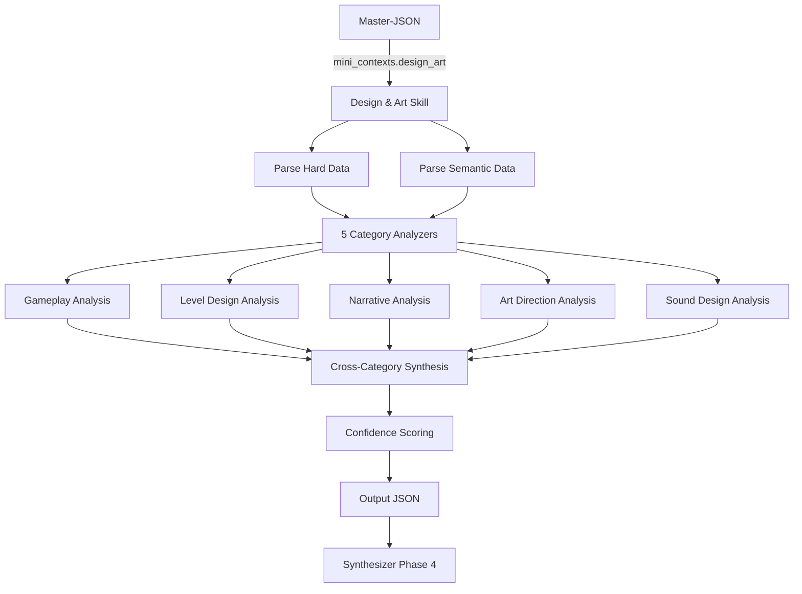

# Design and Art — Macro-Skill Specification

> **Artifact:** `design_art_skill.yaml`  
> **Repository path:** `openspec/specs/macro_skills/design_art_skill.md`  
> **Usage:** Backend Macro-Skill contract for Design & Art analysis  
> **Phase:** Phase 3 (Parallel Analysis)  
> **Macro-Skill:** Design and Art  
> **Categories:** Gameplay, Level Design, Narrative, Art Direction, Sound Design  
> **Status:** Draft  
> **Last Updated:** 2026-06-17

---

## 1. Overview

The **Design and Art Macro-Skill** is one of four parallel analyzers in the GetSmart pipeline. It receives exclusively the **Design & Art Mini-Context** from the Master-JSON and produces structured, professional-grade intelligence covering five thematic categories.

**Output purpose:** Feed processed, categorized, and synthesized insights into the Phase 4 Synthesizer. The Synthesizer will combine this with the other three Macro-Skills to produce the final multi-format report.

**Key principle:** This skill **analyzes**, not copies. Raw social media snippets are synthesized into actionable intelligence with cited sources.

---

## 2. Input Contract

### 2.1 Source

| Field | Value |
|-------|-------|
| **Source path** | `mini_contexts.design_art` |
| **Schema reference** | `master_json_schema.yaml#/definitions/mini_context_design_art` |
| **Data scope** | Hard data + semantic data for Design & Art categories only |

### 2.2 Hard Data Received

| Data | Source API | Usage in Analysis |
|------|-----------|-------------------|
| `genres`, `themes`, `game_modes` | IGDB | Context for gameplay classification |
| `player_perspectives` | IGDB | Camera/design implications |
| `game_engines` | IGDB | Technical constraints on art direction |
| `storyline`, `summary`, `description_raw` | IGDB/RAWG | Narrative foundation |
| `cover_url`, `screenshots`, `videos`, `artworks` | IGDB | Art direction evidence |
| `metacritic`, `esrb_rating`, `ratings_distribution` | RAWG | Reception context |
| `achievements_schema` | Steam Web API | Progression/difficulty analysis |

### 2.3 Semantic Data Received

| Category | Tavily Queries | Expected Platforms |
|----------|---------------|-------------------|
| **Gameplay Mechanics** | combat system, progression, mechanics | Reddit, YouTube, Blogs, Press |
| **Level Design** | world design, pacing, environmental storytelling | Reddit, YouTube, Blogs, Press |
| **Narrative** | story, plot, lore, character | Reddit, YouTube, Blogs, Press |
| **Art Direction** | visual style, graphics, art style | Reddit, YouTube, Blogs, Press |
| **Sound Design** | soundtrack, music, audio, voice acting | Reddit, YouTube, Blogs, Press |

### 2.4 Input Example (Abridged)

```json
{
  "metadata": {
    "game_id": "a1b2c3d4...",
    "game_name": "Elden Ring",
    "macro_skill": "Design and Art",
    "worker_id": "scraper_design_art",
    "data_sources": ["IGDB", "RAWG", "Steam", "Tavily"]
  },
  "hard_data": {
    "genres": ["RPG", "Action"],
    "themes": ["Fantasy", "Dark Fantasy", "Open World"],
    "storyline": "THE NEW FANTASY ACTION RPG...",
    "metacritic": 96,
    "achievements_schema": [...]
  },
  "semantic_data": {
    "gameplay_mechanics": {
      "sources": [
        {
          "url": "https://reddit.com/r/games/...",
          "title": "Elden Ring combat analysis",
          "snippet": "The stagger system creates deep combat...",
          "platform": "reddit"
        }
      ]
    },
    "level_design": { "sources": [...] },
    "narrative": { "sources": [...] },
    "art_direction": { "sources": [...] },
    "sound_design": { "sources": [...] }
  },
  "evidence_count": 25,
  "confidence_score": 0.85
}
```

---

## 3. Output Contract

### 3.1 Output Structure

```json
{
  "metadata": { ... },
  "analysis": {
    "gameplay": { ... },
    "level_design": { ... },
    "narrative": { ... },
    "art_direction": { ... },
    "sound_design": { ... }
  },
  "summary": { ... },
  "confidence": { ... }
}
```

### 3.2 Output Philosophy

| Principle | Implementation |
|-----------|---------------|
| **Synthesis over transcription** | Raw snippets are analyzed, not pasted. Output contains insights, not quotes. |
| **Source attribution** | Every claim references original URLs for traceability. |
| **Enum discipline** | Ratings and classifications use strict enums (no free text). |
| **Honest gaps** | Low-evidence areas are flagged with reduced confidence scores. |
| **Professional tone** | Written for directors, producers, and designers — concise and actionable. |

---

## 4. Category Deep-Dive

### 4.1 Gameplay Mechanics

Analyzes core gameplay systems, their innovation, and player reception.

**Key dimensions:**
- **Mechanic identification:** What systems define the gameplay?
- **Innovation assessment:** Industry-standard, evolutionary, or revolutionary?
- **Reception mapping:** How did players and critics respond?
- **Progression analysis:** How does the game structure player growth?
- **Difficulty philosophy:** What approach to challenge does the game take?

**Output fields:**

| Field | Type | Description |
|-------|------|-------------|
| `overview` | string | Executive summary (2-3 sentences) |
| `key_mechanics[]` | array | Named mechanics with innovation/reception ratings |
| `progression_system` | object | Type, description, pacing assessment |
| `difficulty_balance` | object | Approach, accessibility, sentiment |
| `player_feedback` | object | Strengths, weaknesses, complaints |
| `sources_cited[]` | array | URLs with platform and relevance |

**Enum values:**
- `innovation_level`: `industry_standard`, `evolutionary`, `revolutionary`
- `player_reception`: `negative`, `mixed`, `positive`, `acclaimed`
- `progression_type`: `linear`, `branching`, `open_ended`, `skill_tree`, `hybrid`
- `pacing`: `too_slow`, `balanced`, `too_fast`, `uneven`
- `difficulty_approach`: `handholding`, `guided`, `challenging`, `punishing`, `adaptive`

### 4.2 Level Design

Evaluates world structure, spatial design, and player navigation.

**Key dimensions:**
- **World architecture:** Linear, hub, open-world, or hybrid?
- **Pacing control:** How does the game manage tension and release?
- **Environmental storytelling:** Does the environment communicate narrative?
- **Replay value:** What encourages return visits?

**Output fields:**

| Field | Type | Description |
|-------|------|-------------|
| `overview` | string | Executive summary |
| `world_structure` | object | Type, description, interconnectedness |
| `pacing_flow` | object | Rhythm, tension curve, exploration reward |
| `environmental_storytelling` | object | Presence, quality, examples |
| `replayability` | object | NG+, branching, procedural elements |
| `sources_cited[]` | array | Attributed sources |

**Enum values:**
- `world_type`: `linear`, `hub_based`, `open_world`, `procedural`, `hybrid`
- `interconnectedness`: `low`, `moderate`, `high`
- `rhythm`: `constant`, `peaks_valleys`, `player_driven`
- `exploration_reward`: `sparse`, `balanced`, `generous`, `overwhelming`
- `storytelling_quality`: `minimal`, `functional`, `immersive`, `masterful`

### 4.3 Narrative

Assesses storytelling quality, character work, and worldbuilding depth.

**Key dimensions:**
- **Story coherence:** Does the plot hold together?
- **Emotional impact:** How effectively does it engage emotionally?
- **Character depth:** Are protagonists and supporting cast well-developed?
- **Worldbuilding:** Is the lore rich and consistently integrated?
- **Writing quality:** Dialogue, tone, localization.

**Output fields:**

| Field | Type | Description |
|-------|------|-------------|
| `overview` | string | Executive summary |
| `story_quality` | object | Coherence, impact, originality ratings |
| `character_development` | object | Protagonist, supporting cast, player agency |
| `worldbuilding` | object | Depth, integration style, consistency |
| `writing_style` | object | Tone, dialogue, localization quality |
| `sources_cited[]` | array | Attributed sources |

**Enum values:**
- `coherence`, `emotional_impact`, `originality`: `poor`, `average`, `good`, `excellent` / `low`, `moderate`, `high`, `exceptional` / `derivative`, `familiar`, `fresh`, `groundbreaking`
- `protagonist_depth`, `supporting_cast`: `shallow`, `moderate`, `deep`, `complex` / `forgettable`, `functional`, `memorable`, `iconic`
- `player_agency`: `none`, `limited`, `meaningful`, `full`
- `lore_depth`: `surface`, `moderate`, `deep`, `encyclopedic`
- `lore_integration`: `told`, `shown`, `environmental`, `player_discovered`
- `tone`: `light`, `dramatic`, `dark`, `humorous`, `epic`

### 4.4 Art Direction

Reviews visual identity, technical execution, and artistic cohesion.

**Key dimensions:**
- **Visual style:** Aesthetic approach and distinctiveness
- **Technical quality:** Graphics fidelity, optimization, animation
- **Consistency:** Cohesion across UI, environments, characters
- **Memorable moments:** Specific visual beats that define the experience

**Output fields:**

| Field | Type | Description |
|-------|------|-------------|
| `overview` | string | Executive summary |
| `visual_style` | object | Aesthetic, palette, influences, distinctiveness |
| `technical_execution` | object | Fidelity, optimization, animation |
| `artistic_consistency` | object | Cohesion, UI harmony |
| `memorable_moments[]` | array | Description + significance |
| `sources_cited[]` | array | Attributed sources |

**Enum values:**
- `aesthetic`: `realistic`, `stylized`, `cartoon`, `pixel_art`, `minimalist`, `photorealistic`, `other`
- `distinctiveness`: `generic`, `recognizable`, `iconic`, `genre_defining`
- `graphical_fidelity`, `performance_optimization`, `animation_quality`: `dated`, `adequate`, `good`, `cutting_edge` / `poor`, `average`, `good`, `excellent`
- `cohesion`: `fragmented`, `inconsistent`, `cohesive`, `seamless`
- `ui_harmony`: `clashing`, `neutral`, `harmonious`

### 4.5 Sound Design

Evaluates music, sound effects, voice acting, and audio immersion.

**Key dimensions:**
- **Musical score:** Composer, style, standout tracks, emotional effect
- **Sound effects:** Quality, distinctiveness, spatial audio
- **Voice acting:** Presence, quality, language coverage
- **Audio-gameplay synergy:** How audio reinforces or enhances gameplay

**Output fields:**

| Field | Type | Description |
|-------|------|-------------|
| `overview` | string | Executive summary |
| `music_score` | object | Composer, style, tracks, effectiveness |
| `sound_effects` | object | Quality, distinctiveness, spatial audio, dynamic range |
| `voice_acting` | object | Presence, quality, language coverage |
| `audio_immersion` | object | Overall impact, gameplay synergy |
| `sources_cited[]` | array | Attributed sources |

**Enum values:**
- `emotional_effectiveness`: `poor`, `average`, `good`, `excellent`, `legendary`
- `sfx_quality`, `sfx_distinctiveness`, `va_quality`: `poor`, `average`, `good`, `excellent` / `generic`, `functional`, `distinctive`, `iconic`
- `dynamic_range`: `compressed`, `balanced`, `expansive`
- `language_coverage`: `limited`, `major_languages`, `extensive`
- `overall_impact`: `distracting`, `neutral`, `immersive`, `transformative`
- `gameplay_synergy`: `detracting`, `neutral`, `supportive`, `enhancing`

---

## 5. Cross-Category Summary

The `summary` section synthesizes insights across all five categories into a unified assessment.

| Field | Description |
|-------|-------------|
| `design_philosophy` | Core unifying design philosophy (1 paragraph) |
| `standout_strengths` | Top 3-5 strengths across all categories |
| `critical_weaknesses` | Top 2-4 weaknesses or improvement areas |
| `target_audience_alignment` | Who is this for? What appeals/barriers exist? |
| `competitive_positioning` | How does it compare to genre standards and peers? |

### 5.1 Target Audience Alignment Structure

```json
{
  "primary_audience": "string",
  "appeal_factors": ["string"],
  "potential_barriers": ["string"]
}
```

### 5.2 Competitive Positioning Structure

```json
{
  "genre_benchmark": "string",
  "unique_selling_points": ["string"],
  "comparable_titles": ["string"]
}
```

---

## 6. Confidence System

Every output includes explicit confidence metrics.

| Metric | Range | Description |
|--------|-------|-------------|
| `overall_score` | 0.0–1.0 | Weighted average across categories |
| `category_scores` | 0.0–1.0 each | Per-category confidence |
| `data_quality_notes` | array | Explicit notes on gaps, conflicts, or low-evidence areas |

### 6.1 Confidence Adjustment Rules

| Condition | Adjustment | Rationale |
|-----------|-----------|-----------|
| Evidence count < 3 per category | −0.2 | Insufficient sample |
| Conflicting sources | −0.1 + flag | Uncertainty in consensus |
| No semantic data | Cap at 0.5 | Hard data only |
| High consensus across sources | +0.05 (max 1.0) | Strong agreement |

---

## 7. Anti-Hallucination Strategy

| Guard | Enforcement | Description |
|-------|-------------|-------------|
| **Source Attribution** | Strict | Every claim must cite at least one source URL |
| **Enum Constraint** | Strict | Only predefined enum values allowed |
| **Evidence Threshold** | Automatic | < 3 sources triggers low-confidence flag |
| **No Invented Data** | Strict | No fabricated scores, quotes, or figures |
| **Confidence Transparency** | Mandatory | Data gaps explicitly documented |

---

## 8. System Prompt

```
You are the Design & Art Analyst for GetSmart, a professional game intelligence platform.

Your role is to analyze the provided Mini-Context (hard data + semantic evidence) and produce
a structured, professional intelligence report covering 5 categories: Gameplay, Level Design,
Narrative, Art Direction, and Sound Design.

## Core Rules:
1. ANALYZE, don't copy. Synthesize evidence into insights. Do not paste raw snippets.
2. Cite sources. Every claim must reference at least one source from the context.
3. Be honest about gaps. If evidence is sparse, state it and adjust confidence scores.
4. Use enums strictly. Only use values defined in the output schema.
5. Target audience: Directors, producers, and designers who need actionable intelligence.

## Analysis Guidelines:
- Gameplay: Focus on mechanics innovation, progression design, difficulty philosophy
- Level Design: Analyze world structure, pacing, environmental storytelling
- Narrative: Evaluate story quality, character depth, worldbuilding coherence
- Art Direction: Assess visual identity, technical execution, artistic consistency
- Sound Design: Review music, SFX, voice acting, and audio-gameplay synergy

## Tone:
Professional, analytical, concise. Avoid hyperbole. Use specific examples from evidence.
When comparing to industry standards, name specific comparable titles if evidence supports it.
```

---

## 9. Model Configuration

| Parameter | Value |
|-----------|-------|
| **Model** | Gemini-2.5-flash |
| **Provider** | Google |
| **Temperature** | 0.3 |
| **Max Output Tokens** | 8,000 |
| **Context Window** | 2M tokens |
| **Top-P** | 0.95 |
| **Top-K** | 40 |

**Temperature rationale:** Low temperature (0.3) ensures consistent, deterministic analysis while allowing sufficient creativity for synthesis.

---

## 10. Chunking Strategy

| Strategy | Description |
|----------|-------------|
| **Primary** | Single-pass analysis (full Mini-Context fits in 2M tokens) |
| **Fallback** | Category-sequential if input exceeds 1.8M tokens |

**Category-sequential method:** Analyze each category independently, passing hard_data + relevant semantic_data subset per call.

---

## 11. Caching

| Aspect | Configuration |
|--------|---------------|
| **Enabled** | Yes |
| **Key format** | `skill:design_art:{game_id}:{input_hash}` |
| **TTL** | 24 hours |
| **Invalidation** | Master-JSON version change or new evidence |

---

## 12. Error Handling

### 12.1 Retry Policy

| Parameter | Value |
|-----------|-------|
| Max retries | 3 |
| Backoff | Exponential |
| Initial delay | 1s |
| Max delay | 30s |

### 12.2 Fallback Output

If all retries fail, return a minimal valid structure with `error: true` flags and zero confidence scores. The Synthesizer will handle gracefully.

```json
{
  "metadata": {
    "skill_id": "design_art",
    "skill_name": "Design and Art",
    "generated_at": "ISO8601",
    "model_used": "gemini-2.5-flash"
  },
  "analysis": {
    "gameplay": { "category_id": "gameplay", "category_name": "Gameplay Mechanics", "overview": "Analysis failed", "error": true },
    "level_design": { "category_id": "level_design", "category_name": "Level Design", "overview": "Analysis failed", "error": true },
    "narrative": { "category_id": "narrative", "category_name": "Narrative", "overview": "Analysis failed", "error": true },
    "art_direction": { "category_id": "art_direction", "category_name": "Art Direction", "overview": "Analysis failed", "error": true },
    "sound_design": { "category_id": "sound_design", "category_name": "Sound Design", "overview": "Analysis failed", "error": true }
  },
  "summary": {
    "design_philosophy": "Analysis could not be completed due to system error.",
    "standout_strengths": [],
    "critical_weaknesses": []
  },
  "confidence": {
    "overall_score": 0.0,
    "category_scores": {
      "gameplay": 0.0,
      "level_design": 0.0,
      "narrative": 0.0,
      "art_direction": 0.0,
      "sound_design": 0.0
    },
    "data_quality_notes": ["System error prevented analysis."]
  }
}
```

---

## 13. Flow Diagram



---

## 14. Example: Complete Output for "Elden Ring"

### 14.1 Metadata

```json
{
  "skill_id": "design_art",
  "skill_name": "Design and Art",
  "game_id": "a1b2c3d4-e5f6-7890-abcd-ef1234567890",
  "game_name": "Elden Ring",
  "generated_at": "2026-06-17T15:15:00Z",
  "model_used": "gemini-2.5-flash",
  "input_evidence_count": 25,
  "input_confidence_score": 0.85
}
```

### 14.2 Gameplay Analysis

```json
{
  "category_id": "gameplay",
  "category_name": "Gameplay Mechanics",
  "overview": "Elden Ring evolves the Souls-like formula with an open-world structure, introducing mounted combat and spirit ashes while maintaining the signature methodical combat system.",
  "key_mechanics": [
    {
      "mechanic_name": "Stagger & Posture System",
      "description": "Enemies have hidden posture meters; breaking posture enables critical hits. Adds depth to combat pacing.",
      "innovation_level": "evolutionary",
      "player_reception": "acclaimed"
    },
    {
      "mechanic_name": "Spirit Ashes",
      "description": "Summonable NPC allies that assist in combat. Reduces difficulty barrier while maintaining core challenge.",
      "innovation_level": "evolutionary",
      "player_reception": "positive"
    },
    {
      "mechanic_name": "Mounted Combat (Torrent)",
      "description": "Horseback combat with unique moveset. Enables hit-and-run tactics against large enemies.",
      "innovation_level": "revolutionary",
      "player_reception": "acclaimed"
    }
  ],
  "progression_system": {
    "type": "open_ended",
    "description": "Players freely explore the Lands Between, tackling regions in any order with soft gating via difficulty.",
    "pacing": "balanced"
  },
  "difficulty_balance": {
    "approach": "challenging",
    "accessibility_options": false,
    "player_sentiment": "Widely praised as fair but demanding. Lack of difficulty options is a recurring criticism."
  },
  "player_feedback": {
    "strengths": [
      "Combat depth rewards mastery",
      "Build variety enables diverse playstyles",
      "Boss design is consistently exceptional"
    ],
    "weaknesses": [
      "Late-game enemy damage scaling feels excessive",
      "Some reused boss encounters in dungeons"
    ],
    "common_complaints": [
      "Input buffering issues",
      "Camera problems in tight spaces"
    ]
  },
  "sources_cited": [
    {
      "url": "https://www.reddit.com/r/games/comments/...",
      "platform": "reddit",
      "relevance": "Combat system deep dive"
    },
    {
      "url": "https://www.youtube.com/watch?v=...",
      "platform": "youtube",
      "relevance": "Gameplay analysis review"
    }
  ]
}
```

### 14.3 Level Design Analysis

```json
{
  "category_id": "level_design",
  "category_name": "Level Design",
  "overview": "Seamlessly blends open-world exploration with intricately designed legacy dungeons, creating a sense of discovery without sacrificing handcrafted quality.",
  "world_structure": {
    "type": "open_world",
    "description": "Six major regions connected by a central hub. Underground areas double the explorable space.",
    "interconnectedness": "high"
  },
  "pacing_flow": {
    "rhythm": "player_driven",
    "tension_curve": "Self-directed; legacy dungeons provide structured escalation, open world allows decompression.",
    "exploration_reward": "generous"
  },
  "environmental_storytelling": {
    "present": true,
    "quality": "masterful",
    "examples": [
      "Ruined castles tell stories of past battles without text",
      "Enemy placement indicates territorial control shifts",
      "Item descriptions in legacy dungeons reveal lore"
    ]
  },
  "replayability": {
    "new_game_plus": true,
    "branching_paths": false,
    "procedural_elements": false,
    "player_notes": "High replayability through build variety and missed content, not procedural generation."
  },
  "sources_cited": [
    {
      "url": "https://www.polygon.com/...",
      "platform": "blogs",
      "relevance": "World design analysis"
    }
  ]
}
```

### 14.4 Narrative Analysis

```json
{
  "category_id": "narrative",
  "category_name": "Narrative",
  "overview": "Collaboration between Hidetaka Miyazaki and George R.R. Martin produces a rich mythos told through fragmented environmental storytelling.",
  "story_quality": {
    "coherence": "good",
    "emotional_impact": "high",
    "originality": "fresh"
  },
  "character_development": {
    "protagonist_depth": "shallow",
    "supporting_cast": "memorable",
    "player_agency": "limited"
  },
  "worldbuilding": {
    "depth": "encyclopedic",
    "lore_integration": "player_discovered",
    "consistency": "excellent"
  },
  "writing_style": {
    "tone": "epic",
    "dialogue_quality": "good",
    "localization_quality": "good"
  },
  "sources_cited": [
    {
      "url": "https://www.ign.com/...",
      "platform": "press",
      "relevance": "Narrative and lore analysis"
    }
  ]
}
```

### 14.5 Art Direction Analysis

```json
{
  "category_id": "art_direction",
  "category_name": "Art Direction",
  "overview": "Cohesive dark fantasy aesthetic with distinct regional visual identities. Technical execution balances artistic vision with performance.",
  "visual_style": {
    "aesthetic": "stylized",
    "color_palette": "Muted earth tones with occasional vivid bioluminescence. Each region has a dominant color theme.",
    "art_movement_influence": ["Romanticism", "Gothic architecture"],
    "distinctiveness": "iconic"
  },
  "technical_execution": {
    "graphical_fidelity": "good",
    "performance_optimization": "average",
    "animation_quality": "excellent"
  },
  "artistic_consistency": {
    "cohesion": "seamless",
    "ui_harmony": "harmonious"
  },
  "memorable_moments": [
    {
      "description": "First view of Limgrave from the Stranded Graveyard",
      "significance": "Establishing shot that communicates scale and freedom"
    },
    {
      "description": "Erdtree illumination at night",
      "significance": "Iconic visual that became the game's marketing signature"
    }
  ],
  "sources_cited": [
    {
      "url": "https://www.eurogamer.net/...",
      "platform": "press",
      "relevance": "Art direction critique"
    }
  ]
}
```

### 14.6 Sound Design Analysis

```json
{
  "category_id": "sound_design",
  "category_name": "Sound Design",
  "overview": "Yuka Kitamura's score elevates the epic fantasy tone. Sound design reinforces gameplay feedback with distinctive audio cues.",
  "music_score": {
    "composer": "Yuka Kitamura",
    "style": "Orchestral choral with Japanese folk influences",
    "standout_tracks": [
      "Elden Lord (Main Theme)",
      "Godrick the Grafted",
      "Malenia, Blade of Miquella"
    ],
    "emotional_effectiveness": "excellent"
  },
  "sound_effects": {
    "quality": "excellent",
    "distinctiveness": "distinctive",
    "spatial_audio": true,
    "dynamic_range": "expansive"
  },
  "voice_acting": {
    "present": true,
    "quality": "good",
    "language_coverage": "major_languages"
  },
  "audio_immersion": {
    "overall_impact": "immersive",
    "synergy_with_gameplay": "enhancing"
  },
  "sources_cited": [
    {
      "url": "https://www.youtube.com/watch?v=...",
      "platform": "youtube",
      "relevance": "Soundtrack analysis"
    }
  ]
}
```

### 14.7 Cross-Category Summary

```json
{
  "design_philosophy": "Elden Ring applies FromSoftware's design philosophy of 'difficulty as discovery' to an open-world framework. Every system — combat, exploration, narrative, art, audio — serves the core fantasy of a tarnished warrior reclaiming their destiny in a broken world. The result is a cohesive experience where challenge and beauty coexist.",
  "standout_strengths": [
    "Open-world design that respects player agency without sacrificing handcrafted quality",
    "Combat system with exceptional depth and build variety",
    "Masterful environmental storytelling and worldbuilding",
    "Iconic art direction with strong regional visual identities",
    "Soundtrack that elevates boss encounters to memorable experiences"
  ],
  "critical_weaknesses": [
    "No accessibility/difficulty options limits audience reach",
    "Late-game damage scaling creates frustration spikes",
    "Some boss reuse diminishes discovery in optional dungeons",
    "PC performance issues at launch (since patched)"
  ],
  "target_audience_alignment": {
    "primary_audience": "Hardcore action-RPG players aged 18-35",
    "appeal_factors": [
      "Challenging but fair gameplay",
      "Deep lore and discovery",
      "High-quality boss encounters"
    ],
    "potential_barriers": [
      "High difficulty entry barrier",
      "Minimal handholding for new players",
      "Performance concerns on older hardware"
    ]
  },
  "competitive_positioning": {
    "genre_benchmark": "Sets a new standard for open-world action RPGs, surpassing genre conventions in combat depth while matching exploration quality.",
    "unique_selling_points": [
      "First open-world Souls-like at AAA scale",
      "George R.R. Martin collaboration for lore",
      "Seamless integration of legacy dungeon design into open world"
    ],
    "comparable_titles": [
      "Dark Souls III (combat DNA)",
      "The Legend of Zelda: Breath of the Wild (open-world exploration)",
      "The Witcher 3 (quest density and narrative depth)"
    ]
  }
}
```

### 14.8 Confidence Metrics

```json
{
  "overall_score": 0.85,
  "category_scores": {
    "gameplay": 0.90,
    "level_design": 0.88,
    "narrative": 0.82,
    "art_direction": 0.87,
    "sound_design": 0.80
  },
  "data_quality_notes": [
    "High volume of quality sources for gameplay and art direction",
    "Narrative analysis limited by game's implicit storytelling style",
    "Sound design coverage lighter than other categories in scraped data"
  ]
}
```

---

## 15. Glossary

| Term | Definition |
|------|------------|
| **Mini-Context** | Structured JSON produced by a scraper worker, containing hard and semantic data |
| **Hard Data** | Structured data from direct APIs (IGDB, RAWG, Steam) |
| **Semantic Data** | Unstructured data from web searches (Tavily) |
| **Macro-Skill** | Analysis cluster (Design & Art, UX, Tech & Systems, Strategy & Market) |
| **Synthesizer** | Phase 4 module that unifies all 4 Macro-Skill outputs into final report |
| **Evidence Count** | Number of semantic sources collected for a category |
| **Confidence Score** | [0-1] metric indicating evidence quality and analytical certainty |
| **Enum** | Predefined set of allowed values for a field |

---

*Document generated 2026-06-17 as part of GetSmart v3.0*
