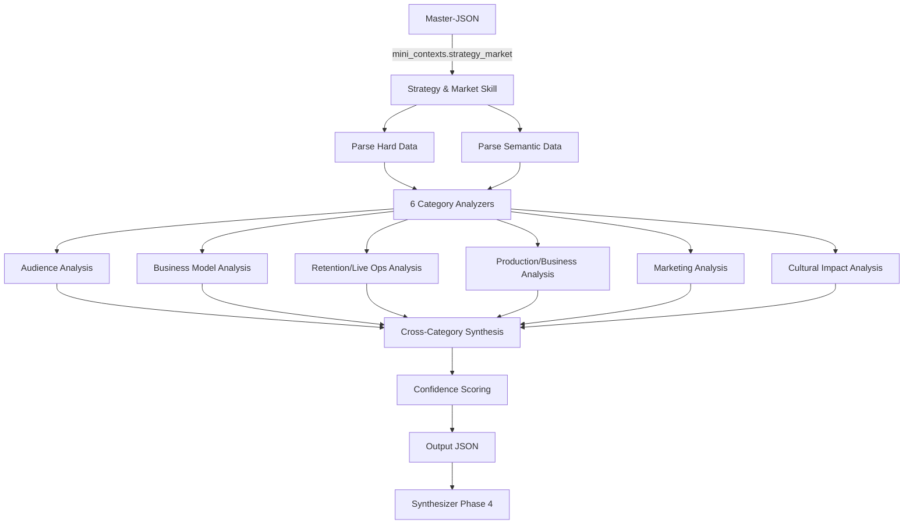

# Strategy and Market — Macro-Skill Specification

> **Artifact:** `strategy_market_skill.yaml`  
> **Repository path:** `openspec/specs/macro_skills/strategy_market_skill.md`  
> **Usage:** Backend Macro-Skill contract for market and strategy intelligence  
> **Phase:** Phase 3 (Parallel Analysis)  
> **Macro-Skill:** Strategy and Market  
> **Categories:** Audience, Business Model, Retention/Live Ops, Production/Business, Marketing, Cultural Impact  
> **Status:** Draft  
> **Last Updated:** 2026-06-17

---

## 1. Overview

The **Strategy and Market Macro-Skill** is one of four parallel analyzers in the GetSmart pipeline. It receives exclusively the **Strategy & Market Mini-Context** from the Master-JSON and produces structured, professional-grade intelligence covering six thematic categories: Audience, Business Model, Retention/Live Ops, Production/Business, Marketing, and Cultural Impact.

**Output purpose:** Feed processed, categorized, and synthesized insights into the Phase 4 Synthesizer. The Synthesizer will combine this with the other three Macro-Skills to produce the final multi-format report.

**Key principle:** This skill **analyzes**, not copies. Raw market data, revenue estimates, player sentiment, and industry reports are synthesized into actionable intelligence with cited sources.

**Target audience:** Business directors, product managers, publishing strategists, and market analysts who need to understand commercial positioning, monetization health, audience demographics, and cultural footprint.

---

## 2. Input Contract

### 2.1 Source

| Field | Value |
|-------|-------|
| **Source path** | `mini_contexts.strategy_market` |
| **Schema reference** | `master_json_schema.yaml#/definitions/mini_context_strategy_market` |
| **Data scope** | Hard data + semantic data for Strategy & Market categories only |

### 2.2 Hard Data Received

| Data | Source API | Usage in Analysis |
|------|-----------|-------------------|
| `genres`, `themes`, `game_modes` | IGDB | Audience segmentation and genre positioning |
| `platforms` | IGDB | Market reach and distribution strategy |
| `release_date`, `first_release_date` | IGDB | Market timing and lifecycle stage |
| `involved_companies`, `developers`, `publishers` | IGDB | Production capacity and publishing power |
| `metacritic`, `ratings_distribution` | RAWG | Critical reception as market signal |
| `price_usd`, `price_history` | Steam Storefront | Pricing strategy and discount patterns |
| `player_count_peak`, `player_count_current` | Steam Web API | Engagement trends and live service health |
| `estimated_owners`, `estimated_revenue` | SteamSpy | Market size and revenue estimation |
| `review_score`, `review_count` | Steam Storefront | Player sentiment and volume |
| `achievements_schema` | Steam Web API | Engagement depth and completion rates |
| `dlc_count`, `dlc_price_total` | Steam Storefront | Post-launch monetization strategy |
| `tags` | Steam Storefront | Audience targeting and feature marketing |

### 2.3 Semantic Data Received

| Category | Tavily Queries | Expected Platforms |
|----------|---------------|-------------------|
| **Audience** | player demographics, target audience, community | Reddit, Steam Reviews, Forums, Press |
| **Business Model** | monetization, pricing, revenue, sales | Press, Industry Blogs, SteamSpy, Reddit |
| **Retention/Live Ops** | player retention, updates, seasons, events | Reddit, Steam Reviews, Press, Dev Blogs |
| **Production/Business** | development cost, team size, publisher | Press, Industry Reports, LinkedIn, Dev Blogs |
| **Marketing** | campaign, trailers, influencer, social media | Press, Social Media, YouTube, Twitch |
| **Cultural Impact** | cultural phenomenon, memes, awards, legacy | Reddit, Twitter/X, Press, YouTube |

### 2.4 Input Example (Abridged)

```json
{
  "metadata": {
    "game_id": "a1b2c3d4...",
    "game_name": "Elden Ring",
    "macro_skill": "Strategy and Market",
    "worker_id": "scraper_strategy_market",
    "data_sources": ["IGDB", "RAWG", "Steam", "SteamSpy", "Tavily"]
  },
  "hard_data": {
    "genres": ["RPG", "Action"],
    "themes": ["Fantasy", "Dark Fantasy", "Open World"],
    "platforms": ["PC", "PS4", "PS5", "Xbox One", "Xbox Series X|S"],
    "release_date": "2022-02-25",
    "developers": ["FromSoftware"],
    "publishers": ["Bandai Namco Entertainment", "FromSoftware"],
    "metacritic": 96,
    "price_usd": 59.99,
    "player_count_peak": 953426,
    "player_count_current": 45000,
    "estimated_owners": "20M-50M",
    "estimated_revenue": "$1.2B+",
    "review_score": 0.95,
    "review_count": 1000000,
    "dlc_count": 1,
    "dlc_price_total": 39.99,
    "tags": ["Souls-like", "Open World", "Difficult", "RPG", "Action", "Fantasy"]
  },
  "semantic_data": {
    "audience": { "sources": [...] },
    "business_model": { "sources": [...] },
    "retention_live_ops": { "sources": [...] },
    "production_business": { "sources": [...] },
    "marketing": { "sources": [...] },
    "cultural_impact": { "sources": [...] }
  },
  "evidence_count": 28,
  "confidence_score": 0.82
}
```

---

## 3. Output Contract

### 3.1 Output Structure

```json
{
  "metadata": { ... },
  "analysis": {
    "audience": { ... },
    "business_model": { ... },
    "retention_live_ops": { ... },
    "production_business": { ... },
    "marketing": { ... },
    "cultural_impact": { ... }
  },
  "summary": { ... },
  "confidence": { ... }
}
```

### 3.2 Output Philosophy

| Principle | Implementation |
|-----------|---------------|
| **Synthesis over transcription** | Raw market data is analyzed, not pasted. Output contains insights, not quotes. |
| **Source attribution** | Every claim references original URLs for traceability. |
| **Enum discipline** | Ratings and classifications use strict enums (no free text). |
| **Honest gaps** | Low-evidence areas are flagged with reduced confidence scores. |
| **Professional tone** | Written for business strategists and product managers — concise and actionable. |
| **Quantitative grounding** | Use numbers from hard data. Estimate ranges only when evidence supports. |

---

## 4. Category Deep-Dive

### 4.1 Audience

Analyzes player demographics, community composition, and audience segmentation.

**Key dimensions:**
- **Demographics:** Age range, gender distribution, geographic concentration
- **Player psychographics:** Motivations (challenge, exploration, social), playstyle preferences
- **Community health:** Toxicity levels, engagement depth, content creation ecosystem
- **Segmentation:** Core fans vs. casual players, genre veterans vs. newcomers
- **Accessibility barriers:** Price, difficulty, platform requirements, cultural barriers

**Output fields:**

| Field | Type | Description |
|-------|------|-------------|
| `overview` | string | Executive summary (2-3 sentences) |
| `demographics` | object | Age, gender, geography, platform preference |
| `psychographics` | object | Motivations, playstyles, engagement patterns |
| `community_health` | object | Toxicity, content creation, moderation quality |
| `segmentation` | object | Core/casual split, genre experience levels |
| `accessibility_barriers` | object | Price, difficulty, platform, cultural barriers |
| `sources_cited[]` | array | URLs with platform and relevance |

**Enum values:**
- `age_range`: `children`, `teens`, `young_adults`, `adults`, `mature`, `broad`
- `gender_skew`: `male_heavy`, `slight_male`, `balanced`, `slight_female`, `female_heavy`
- `geographic_concentration`: `single_region`, `regional`, `global`, `global_strong_emerging`
- `toxicity_level`: `toxic`, `moderate`, `low`, `supportive`
- `content_creation_volume`: `minimal`, `moderate`, `high`, `massive`
- `engagement_depth`: `casual`, `moderate`, `dedicated`, `hardcore`
- `price_barrier`: `prohibitive`, `significant`, `moderate`, `low`, `none`
- `difficulty_barrier`: `extreme`, `high`, `moderate`, `low`, `none`

### 4.2 Business Model

Evaluates monetization strategy, pricing, revenue performance, and commercial sustainability.

**Key dimensions:**
- **Pricing strategy:** Launch price, regional pricing, discount cadence, sale performance
- **Revenue model:** Premium, subscription, F2P, hybrid, DLC/season pass
- **Revenue performance:** Estimated sales, revenue, attach rate, ARPPU
- **Monetization ethics:** Pay-to-win concerns, fairness perception, value-for-money sentiment
- **Commercial sustainability:** Long-term revenue trajectory, sequel/DLC potential

**Output fields:**

| Field | Type | Description |
|-------|------|-------------|
| `overview` | string | Executive summary |
| `pricing_strategy` | object | Price points, discount patterns, regional variation |
| `revenue_model` | object | Model type, DLC strategy, subscription inclusion |
| `revenue_performance` | object | Sales estimates, revenue, attach rates |
| `monetization_ethics` | object | Fairness, P2W concerns, value perception |
| `commercial_sustainability` | object | Long-term trajectory, expansion potential |
| `sources_cited[]` | array | Attributed sources |

**Enum values:**
- `revenue_model_type`: `premium`, `premium_plus_dlc`, `subscription`, `f2p`, `f2p_plus_battle_pass`, `hybrid`
- `pricing_tier`: `budget`, `mid_tier`, `premium`, `aaa_premium`, `collector`
- `discount_frequency`: `rare`, `occasional`, `frequent`, `aggressive`
- `value_perception`: `poor`, `fair`, `good`, `excellent`
- `monetization_fairness`: `predatory`, `aggressive`, `fair`, `generous`
- `sustainability_rating`: `unsustainable`, `risky`, `stable`, `highly_sustainable`
- `dlc_strategy`: `none`, `expansion`, `season_pass`, `continuous`, `cosmetic_only`

### 4.3 Retention/Live Ops

Assesses player retention mechanics, update cadence, live service health, and long-term engagement.

**Key dimensions:**
- **Retention mechanics:** Progression systems, daily/weekly incentives, social hooks
- **Update cadence:** Patch frequency, content drops, balance changes, seasonal events
- **Live service health:** Concurrent player trends, churn indicators, comeback events
- **Content lifecycle:** DLC strategy, expansion quality, endgame depth
- **Community management:** Dev communication, feedback loops, crisis response

**Output fields:**

| Field | Type | Description |
|-------|------|-------------|
| `overview` | string | Executive summary |
| `retention_mechanics` | object | Systems that keep players engaged long-term |
| `update_cadence` | object | Frequency, quality, and type of updates |
| `live_service_health` | object | Player trends, churn, re-engagement success |
| `content_lifecycle` | object | DLC, expansions, endgame, content depth |
| `community_management` | object | Dev communication, transparency, crisis handling |
| `sources_cited[]` | array | Attributed sources |

**Enum values:**
- `retention_strength`: `weak`, `moderate`, `strong`, `exceptional`
- `update_frequency`: `sporadic`, `quarterly`, `monthly`, `bi_weekly`, `weekly`
- `update_quality`: `poor`, `functional`, `good`, `excellent`
- `live_service_status`: `declining`, `stable`, `growing`, `surge`
- `endgame_depth`: `shallow`, `moderate`, `deep`, `infinite`
- `dev_communication`: `silent`, `reactive`, `proactive`, `transparent`
- `crisis_response`: `poor`, `slow`, `adequate`, `excellent`

### 4.4 Production/Business

Analyzes development context, team capacity, publisher strategy, and production risks.

**Key dimensions:**
- **Development context:** Team size, engine, development timeline, crunch reports
- **Publisher power:** Marketing budget, distribution reach, platform relationships
- **Production risks:** Scope creep, delays, budget overruns, technical debt
- **Post-launch support:** Team allocation, live service commitment, roadmap clarity
- **IP strategy:** Franchise potential, licensing, spin-offs, multimedia expansion

**Output fields:**

| Field | Type | Description |
|-------|------|-------------|
| `overview` | string | Executive summary |
| `development_context` | object | Team, timeline, engine, crunch |
| `publisher_power` | object | Budget, reach, platform relationships |
| `production_risks` | object | Scope, delays, budget, technical debt |
| `post_launch_support` | object | Team allocation, roadmap, commitment |
| `ip_strategy` | object | Franchise potential, licensing, multimedia |
| `sources_cited[]` | array | Attributed sources |

**Enum values:**
- `team_size_category`: `indie`, `small`, `mid`, `large`, `aaa`
- `development_timeline`: `rushed`, `standard`, `extended`, `prolonged`
- `crunch_severity`: `none`, `minor`, `significant`, `severe`, `crisis`
- `publisher_tier`: `indie`, `mid`, `major`, `platform_holder`, `mega_publisher`
- `production_risk_level`: `low`, `moderate`, `high`, `critical`
- `live_service_commitment`: `none`, `minimal`, `moderate`, `full`, `franchise_priority`
- `ip_expansion_potential`: `none`, `limited`, `moderate`, `high`, `universe`

### 4.5 Marketing

Evaluates marketing campaign effectiveness, brand positioning, and community building.

**Key dimensions:**
- **Pre-launch marketing:** Hype building, trailers, demos, influencer seeding
- **Launch campaign:** Media coverage, review embargo strategy, platform features
- **Post-launch marketing:** DLC marketing, sales promotions, re-engagement campaigns
- **Brand positioning:** Tagline, key messaging, competitive differentiation
- **Community building:** Social media presence, official channels, UGC encouragement
- **Influencer strategy:** Streamer partnerships, content creator support, esports

**Output fields:**

| Field | Type | Description |
|-------|------|-------------|
| `overview` | string | Executive summary |
| `pre_launch_marketing` | object | Hype, trailers, demos, influencer seeding |
| `launch_campaign` | object | Media strategy, embargo, platform features |
| `post_launch_marketing` | object | DLC, sales, re-engagement, evergreen |
| `brand_positioning` | object | Messaging, differentiation, identity |
| `community_building` | object | Social media, UGC, official channels |
| `influencer_strategy` | object | Streamers, creators, esports, partnerships |
| `sources_cited[]` | array | Attributed sources |

**Enum values:**
- `hype_level`: `under_the_radar`, `niche`, `moderate`, `high`, `phenomenon`
- `trailer_quality`: `poor`, `functional`, `good`, `excellent`, `viral`
- `review_embargo_strategy`: `none`, `day_of`, `early`, `selective`, `no_embargo`
- `marketing_spend_tier`: `minimal`, `moderate`, `high`, `massive`, `platform_push`
- `brand_recognition`: `unknown`, `niche`, `genre_known`, `mainstream`, `household`
- `community_strength`: `weak`, `moderate`, `strong`, `passionate`, `tribal`
- `influencer_integration`: `none`, `organic`, `sponsored`, `deep_partnership`, `platform_exclusive`

### 4.6 Cultural Impact

Assesses the game's cultural footprint, legacy, awards, and influence beyond gaming.

**Key dimensions:**
- **Awards recognition:** GOTY wins, nominations, critical accolades
- **Mainstream penetration:** Memes, references in other media, non-gamer awareness
- **Industry influence:** Genre impact, mechanic imitation, design philosophy adoption
- **Legacy assessment:** Historical significance, retrospective value, preservation status
- **Cross-media presence:** Adaptations (film, TV, comics), merchandise, collaborations
- **Community legacy:** Speedrunning, modding, academic study, fan creations

**Output fields:**

| Field | Type | Description |
|-------|------|-------------|
| `overview` | string | Executive summary |
| `awards_recognition` | object | GOTY, nominations, critical awards |
| `mainstream_penetration` | object | Memes, media references, non-gamer awareness |
| `industry_influence` | object | Genre impact, mechanic imitation, design adoption |
| `legacy_assessment` | object | Historical significance, retrospective, preservation |
| `cross_media_presence` | object | Adaptations, merchandise, collaborations |
| `community_legacy` | object | Speedruns, mods, academic study, fan creations |
| `sources_cited[]` | array | Attributed sources |

**Enum values:**
- `awards_tier`: `none`, `nominated`, `winner_genre`, `winner_major`, `sweep`
- `mainstream_reach`: `gaming_only`, `genre_media`, `mainstream_media`, `pop_culture`, `global_phenomenon`
- `industry_influence_level`: `none`, `genre_entry`, `genre_standard`, `industry_influence`, `paradigm_shift`
- `legacy_status`: `forgettable`, `solid`, `notable`, `classic`, `masterpiece`, `landmark`
- `cross_media_scope`: `none`, `merchandise`, `comics_novels`, `film_tv_in_development`, `released_multimedia`, `transmedia_franchise`
- `community_longevity`: `fading`, `stable`, `active`, `vibrant`, `evergreen`

---

## 5. Cross-Category Summary

The `summary` section synthesizes insights across all six categories into a unified strategic assessment.

| Field | Description |
|-------|-------------|
| `strategic_positioning` | Core market positioning that unifies all 6 categories (1 paragraph) |
| `standout_strengths` | Top 3-5 commercial/strategic strengths across all categories |
| `critical_weaknesses` | Top 2-4 commercial/strategic weaknesses or risks |
| `market_opportunities` | Untapped segments, expansion vectors, growth opportunities |
| `threats_and_risks` | External threats, competitive pressure, market risks |
| `competitive_positioning` | How does commercial/strategic execution compare to genre standards? |
| `future_outlook` | 12-24 month projection for the title's commercial trajectory |

### 5.1 Market Opportunities Structure

```json
{
  "market_opportunities": [
    {
      "opportunity": "string",
      "category": "audience | business_model | retention_live_ops | production_business | marketing | cultural_impact",
      "potential_impact": "low | medium | high | transformative",
      "effort_required": "low | medium | high",
      "time_horizon": "string",
      "rationale": "string"
    }
  ]
}
```

### 5.2 Threats and Risks Structure

```json
{
  "threats_and_risks": [
    {
      "threat": "string",
      "category": "audience | business_model | retention_live_ops | production_business | marketing | cultural_impact",
      "likelihood": "low | medium | high",
      "impact": "low | medium | high | critical",
      "mitigation": "string",
      "timeline_concern": "string"
    }
  ]
}
```

### 5.3 Future Outlook Structure

```json
{
  "future_outlook": {
    "twelve_month_projection": "string",
    "twenty_four_month_projection": "string",
    "key_assumptions": ["string"],
    "upside_scenarios": ["string"],
    "downside_scenarios": ["string"]
  }
}
```

---

## 6. Confidence System

Every output includes explicit confidence metrics.

| Metric | Range | Description |
|--------|-------|-------------|
| `overall_score` | 0.0–1.0 | Weighted average across categories |
| `category_scores` | 0.0–1.0 each | Per-category confidence |
| `data_quality_notes` | array | Explicit notes on gaps, conflicts, or low-evidence areas |

### 6.1 Confidence Adjustment Rules

| Condition | Adjustment | Rationale |
|-----------|-----------|-----------|
| Evidence count < 3 per category | −0.2 | Insufficient sample |
| Revenue data from unofficial estimates | −0.1 | Uncertainty in accuracy |
| Conflicting market reports | −0.1 + flag | Analyst variance |
| No semantic data | Cap at 0.5 | Hard data only |
| Official financial disclosure available | +0.05 | Authoritative source |
| High consensus across industry analysts | +0.05 (max 1.0) | Strong agreement |

---

## 7. Anti-Hallucination Strategy

| Guard | Enforcement | Description |
|-------|-------------|-------------|
| **Source Attribution** | Strict | Every claim must cite at least one source URL |
| **Enum Constraint** | Strict | Only predefined enum values allowed |
| **Evidence Threshold** | Automatic | < 3 sources triggers low-confidence flag |
| **No Invented Data** | Strict | No fabricated revenue, sales figures, or demographics |
| **Confidence Transparency** | Mandatory | Data gaps explicitly documented |
| **Financial Data Grounding** | Strict | Revenue/sales must use SteamSpy estimates or official disclosures; never invent |
| **Analyst Consensus** | Recommended | Flag when analyst estimates vary significantly |

---

## 8. System Prompt

```
You are the Strategy and Market Analyst for GetSmart, a professional game intelligence platform.

Your role is to analyze the provided Mini-Context (hard data + semantic evidence) and produce
a structured, professional intelligence report covering 6 categories: Audience, Business Model,
Retention/Live Ops, Production/Business, Marketing, and Cultural Impact.

## Core Rules:
1. ANALYZE, don't copy. Synthesize evidence into insights. Do not paste raw snippets.
2. Cite sources. Every claim must reference at least one source from the context.
3. Be honest about gaps. If evidence is sparse, state it and adjust confidence scores.
4. Use enums strictly. Only use values defined in the output schema.
5. Target audience: Business directors, product managers, publishing strategists, and market analysts.
6. Quantify when possible. Use hard data numbers. Estimate ranges only when evidence supports.

## Analysis Guidelines:
- Audience: Focus on demographics, psychographics, community health, segmentation
- Business Model: Analyze pricing, revenue model, monetization ethics, sustainability
- Retention/Live Ops: Evaluate retention systems, update cadence, live service health, content lifecycle
- Production/Business: Assess team capacity, publisher power, production risks, IP strategy
- Marketing: Review campaign effectiveness, brand positioning, community building, influencer strategy
- Cultural Impact: Measure awards, mainstream penetration, industry influence, legacy, cross-media

## Tone:
Professional, commercially astute, risk-aware. Identify market opportunities and threats.
Reference specific comparable titles for benchmarking when evidence supports.
Avoid hype. Use conservative estimates when data is uncertain.
```

---

## 9. Model Configuration

| Parameter | Value |
|-----------|-------|
| **Model** | Gemini-2.5-flash |
| **Provider** | Google |
| **Temperature** | 0.3 |
| **Max Output Tokens** | 8,000 |
| **Context Window** | 2M tokens |
| **Top-P** | 0.95 |
| **Top-K** | 40 |

**Temperature rationale:** Low temperature (0.3) ensures consistent, deterministic analysis while allowing sufficient creativity for synthesis.

---

## 10. Chunking Strategy

| Strategy | Description |
|----------|-------------|
| **Primary** | Single-pass analysis (full Mini-Context fits in 2M tokens) |
| **Fallback** | Category-sequential if input exceeds 1.8M tokens |

**Category-sequential method:** Analyze each category independently, passing hard_data + relevant semantic_data subset per call.

---

## 11. Caching

| Aspect | Configuration |
|--------|---------------|
| **Enabled** | Yes |
| **Key format** | `skill:strategy_market:{game_id}:{input_hash}` |
| **TTL** | 24 hours |
| **Invalidation** | Master-JSON version change or new evidence |

---

## 12. Error Handling

### 12.1 Retry Policy

| Parameter | Value |
|-----------|-------|
| Max retries | 3 |
| Backoff | Exponential |
| Initial delay | 1s |
| Max delay | 30s |

### 12.2 Fallback Output

If all retries fail, return a minimal valid structure with `error: true` flags and zero confidence scores. The Synthesizer will handle gracefully.

```json
{
  "metadata": {
    "skill_id": "strategy_market",
    "skill_name": "Strategy and Market",
    "generated_at": "ISO8601",
    "model_used": "gemini-2.5-flash"
  },
  "analysis": {
    "audience": { "category_id": "audience", "category_name": "Audience", "overview": "Analysis failed", "error": true },
    "business_model": { "category_id": "business_model", "category_name": "Business Model", "overview": "Analysis failed", "error": true },
    "retention_live_ops": { "category_id": "retention_live_ops", "category_name": "Retention/Live Ops", "overview": "Analysis failed", "error": true },
    "production_business": { "category_id": "production_business", "category_name": "Production/Business", "overview": "Analysis failed", "error": true },
    "marketing": { "category_id": "marketing", "category_name": "Marketing", "overview": "Analysis failed", "error": true },
    "cultural_impact": { "category_id": "cultural_impact", "category_name": "Cultural Impact", "overview": "Analysis failed", "error": true }
  },
  "summary": {
    "strategic_positioning": "Analysis could not be completed due to system error.",
    "standout_strengths": [],
    "critical_weaknesses": [],
    "market_opportunities": [],
    "threats_and_risks": [],
    "competitive_positioning": {
      "genre_benchmark": "unknown",
      "unique_selling_points": [],
      "comparable_titles": []
    },
    "future_outlook": {
      "twelve_month_projection": "unknown",
      "twenty_four_month_projection": "unknown",
      "key_assumptions": [],
      "upside_scenarios": [],
      "downside_scenarios": []
    }
  },
  "confidence": {
    "overall_score": 0.0,
    "category_scores": {
      "audience": 0.0,
      "business_model": 0.0,
      "retention_live_ops": 0.0,
      "production_business": 0.0,
      "marketing": 0.0,
      "cultural_impact": 0.0
    },
    "data_quality_notes": ["System error prevented analysis."]
  }
}
```

---

## 13. Flow Diagram



---

## 14. Example: Complete Output for "Elden Ring"

### 14.1 Metadata

```json
{
  "skill_id": "strategy_market",
  "skill_name": "Strategy and Market",
  "game_id": "a1b2c3d4-e5f6-7890-abcd-ef1234567890",
  "game_name": "Elden Ring",
  "generated_at": "2026-06-17T15:15:00Z",
  "model_used": "gemini-2.5-flash",
  "input_evidence_count": 28,
  "input_confidence_score": 0.82
}
```

### 14.2 Audience Analysis

```json
{
  "category_id": "audience",
  "category_name": "Audience",
  "overview": "Elden Ring successfully expanded the Souls-like audience beyond the hardcore niche, attracting open-world RPG fans while retaining its core fanbase. The audience skews male and young-adult but shows broader geographic reach than typical niche Japanese titles.",
  "demographics": {
    "age_range": "young_adults",
    "gender_skew": "male_heavy",
    "geographic_concentration": "global",
    "platform_preference": "PC and PlayStation dominant; Xbox significant but smaller. Console players slightly outnumber PC."
  },
  "psychographics": {
    "primary_motivations": ["challenge", "exploration", "discovery", "mastery"],
    "playstyle_preferences": ["solo_exploration", "build_experimentation", "boss_challenge"],
    "engagement_patterns": "Deep single-session play (3-5 hours). High completion intent. Strong wiki/guide engagement."
  },
  "community_health": {
    "toxicity_level": "moderate",
    "content_creation_volume": "massive",
    "moderation_quality": "Community-driven. Subreddit moderators active. Some gatekeeping behavior toward newcomers.",
    "notable_communities": ["r/Eldenring (2M+ members)", "Fextralife Wiki", "Speedrun.com", "YouTube lore channels"]
  },
  "segmentation": {
    "core_fans": "FromSoftware veterans familiar with Souls mechanics. 30-40% of player base.",
    "genre_expansion": "Open-world RPG fans drawn by critical acclaim and George R.R. Martin name. 40-50% of player base.",
    "casual_tourists": "Players who purchased due to hype but bounced off difficulty. 15-20% of player base.",
    "newcomer_conversion": "Moderate. Some casual players converted to hardcore fans; significant churn from difficulty barrier."
  },
  "accessibility_barriers": {
    "price_barrier": "low",
    "difficulty_barrier": "high",
    "platform_barrier": "low",
    "cultural_barrier": "low",
    "notes": "Price is standard AAA ($59.99). Difficulty is the primary barrier, filtering out a significant portion of the potential audience."
  },
  "sources_cited": [
    {
      "url": "https://reddit.com/r/Eldenring/comments/...",
      "platform": "reddit",
      "relevance": "Community demographics and newcomer experience threads"
    },
    {
      "url": "https://steamspy.com/app/1245620",
      "platform": "steamspy",
      "relevance": "Ownership estimates and player behavior"
    }
  ]
}
```

### 14.3 Business Model Analysis

```json
{
  "category_id": "business_model",
  "category_name": "Business Model",
  "overview": "Premium AAA model with a single major expansion (Shadow of the Erdtree). No microtransactions, battle passes, or live service monetization. Commercially conservative but extraordinarily successful due to massive volume.",
  "pricing_strategy": {
    "launch_price_usd": 59.99,
    "pricing_tier": "aaa_premium",
    "discount_frequency": "occasional",
    "discount_pattern": "First major sale at 6 months (20% off). Deep discounts (50%+) only after 18 months. DLC maintains premium pricing.",
    "regional_pricing": "Applied on Steam. Emerging markets receive significant discounts. Console pricing varies by region.",
    "value_perception": "excellent"
  },
  "revenue_model": {
    "primary_model": "premium_plus_dlc",
    "dlc_strategy": "expansion",
    "subscription_inclusion": "Not included in Game Pass or PS Plus at launch. Standalone purchase only.",
    "microtransactions": false,
    "notes": "Pure premium model. No cosmetic store, no currency packs, no battle pass. Revenue comes from unit sales + DLC expansion."
  },
  "revenue_performance": {
    "estimated_units_sold": "25M+ (as of 2024)",
    "estimated_revenue": "$1.5B+ (including DLC)",
    "attach_rate": "DLC attach rate estimated at 30-40% of base game owners.",
    "platform_revenue_split": "PC ~30%, PlayStation ~45%, Xbox ~25% (estimated)",
    "notes": "SteamSpy estimates 20M-50M owners on PC alone. Console sales likely higher. Shadow of the Erdtree sold 5M units in 3 days."
  },
  "monetization_ethics": {
    "monetization_fairness": "generous",
    "pay_to_win_concerns": false,
    "value_for_money_sentiment": "Overwhelmingly positive. Players cite 100+ hours of content for $60 as exceptional value.",
    "dlc_reception": "Mixed on pricing ($39.99 for expansion). Some players felt it was steep, but quality justified cost for most."
  },
  "commercial_sustainability": {
    "sustainability_rating": "highly_sustainable",
    "long_term_trajectory": "Continued sales through word-of-mouth and DLC. Long tail typical of premium single-player hits.",
    "sequel_potential": "Extremely high. Elden Ring 2 or spiritual successor virtually guaranteed given performance.",
    "expansion_potential": "DLC model proven. Future titles likely to follow premium + expansion strategy."
  },
  "sources_cited": [
    {
      "url": "https://steamspy.com/app/1245620",
      "platform": "steamspy",
      "relevance": "Revenue and ownership estimates"
    },
    {
      "url": "https://bandainamcoent.com/news/...",
      "platform": "press",
      "relevance": "Official sales milestones and DLC performance"
    }
  ]
}
```

### 14.4 Retention/Live Ops Analysis

```json
{
  "category_id": "retention_live_ops",
  "category_name": "Retention/Live Ops",
  "overview": "Elden Ring is not a live service game. Retention is driven by single-player content depth, NG+, build variety, and community engagement rather than scheduled updates. Post-launch support focused on patches and one major expansion.",
  "retention_mechanics": {
    "retention_strength": "strong",
    "primary_drivers": [
      "Deep single-player content (80-120 hours first playthrough)",
      "New Game Plus with escalating difficulty",
      "Build variety encouraging replay",
      "Missable content driving return visits",
      "Cooperative and PvP multiplayer"
    ],
    "session_length": "Long sessions (3-5 hours). Players often binge during first playthrough.",
    "return_triggers": "DLC releases, major patches, community events, personal challenge goals (level 1 runs, no-hit runs)"
  },
  "update_cadence": {
    "update_frequency": "quarterly",
    "update_quality": "good",
    "patch_focus": "Balance adjustments, bug fixes, performance improvements, anti-cheat updates",
    "content_updates": "No seasonal content. One major expansion (Shadow of the Erdtree) 2.5 years post-launch.",
    "notes": "Patch cadence slowed significantly after first year. No live service roadmap."
  },
  "live_service_health": {
    "live_service_status": "stable",
    "concurrent_player_trends": "Peak 953K at launch. Stabilized at 40K-60K daily concurrent 2+ years post-launch. DLC spike to 500K+ concurrent.",
    "churn_indicators": "Natural single-player churn after completion. High completion rate (~40% achieve major ending achievements).",
    "re_engagement_success": "DLC re-engaged significant portion of lapsed players. Sales spikes during Steam sales.",
    "player_lifetime": "High for single-player. 60-100 hours average. Top 10% exceed 300 hours."
  },
  "content_lifecycle": {
    "endgame_depth": "deep",
    "dlc_quality": "Shadow of the Erdtree: Critically acclaimed but criticized for difficulty spike. 20-30 hours of content.",
    "post_dlc_roadmap": "No further content announced. FromSoftware historically moves to next project after DLC.",
    "content_gaps": "No procedural endgame. No seasonal events. No ongoing content pipeline."
  },
  "community_management": {
    "dev_communication": "reactive",
    "transparency": "Low. FromSoftware rarely communicates directly. Patch notes are minimal. No developer blogs or roadmaps.",
    "crisis_response": "adequate",
    "crisis_examples": "PC performance issues at launch addressed in patches. Easy Anti-Cheat controversy resolved. DLC difficulty backlash acknowledged but not fundamentally changed."
  },
  "sources_cited": [
    {
      "url": "https://steamdb.info/app/1245620/charts/",
      "platform": "steamdb",
      "relevance": "Player count trends and DLC spikes"
    },
    {
      "url": "https://reddit.com/r/Eldenring/comments/...",
      "platform": "reddit",
      "relevance": "Player retention and DLC feedback"
    }
  ]
}
```

### 14.5 Production/Business Analysis

```json
{
  "category_id": "production_business",
  "category_name": "Production/Business",
  "overview": "FromSoftware's most ambitious project, developed with a mid-sized team (~200-300) over approximately 4 years. Published by Bandai Namco with significant marketing investment. Production was efficient by AAA standards, with no major delays or public crunch reports.",
  "development_context": {
    "team_size_category": "mid",
    "estimated_team_size": "200-300 developers",
    "development_timeline": "standard",
    "development_duration": "Approximately 4 years (post-Sekiro)",
    "engine": "Proprietary FromSoftware engine (evolved from Dark Souls III)",
    "crunch_severity": "none",
    "crunch_reports": "No public reports of crunch. FromSoftware has reputation for sustainable development culture.",
    "budget_estimate": "$80M-$120M (including marketing). Highly efficient for a 25M+ seller."
  },
  "publisher_power": {
    "publisher_tier": "major",
    "publisher_name": "Bandai Namco Entertainment",
    "marketing_budget": "High. Global campaign with TV spots, influencer partnerships, and platform holder co-marketing.",
    "distribution_reach": "Global physical and digital distribution. Strong relationships with Sony and Microsoft.",
    "platform_relationships": "Favored partner status with Sony (PlayStation marketing). Day-one on Xbox Game Pass not offered."
  },
  "production_risks": {
    "production_risk_level": "low",
    "scope_creep": "Managed. Open-world scope was significant expansion but team had Sekiro experience.",
    "delays": "One minor delay from January 2022 to February 2022 (4 weeks).",
    "budget_overruns": "No reports of budget issues. Efficient production typical of FromSoftware.",
    "technical_debt": "Moderate. Engine aging but team had deep expertise."
  },
  "post_launch_support": {
    "live_service_commitment": "minimal",
    "team_allocation_post_launch": "Small live team for patches. Majority of studio moved to next project (Armored Core VI, then next Souls-like).",
    "roadmap_clarity": "No public roadmap. DLC announced 1 year post-launch."
  },
  "ip_strategy": {
    "ip_expansion_potential": "high",
    "franchise_potential": "Extremely high. Elden Ring established as flagship IP alongside Dark Souls.",
    "multimedia_expansion": "Comic adaptation announced. No film/TV confirmed as of 2024.",
    "merchandise": "Limited official merchandise. High demand for figures, art books, and apparel.",
    "licensing": "George R.R. Martin collaboration for lore. No other licensing deals.",
    "notes": "FromSoftware historically focuses on games over transmedia. IP expansion likely to remain conservative."
  },
  "sources_cited": [
    {
      "url": "https://gamesindustry.biz/...",
      "platform": "press",
      "relevance": "Development and production analysis"
    },
    {
      "url": "https://linkedin.com/company/fromsoftware",
      "platform": "press",
      "relevance": "Team size and hiring patterns"
    }
  ]
}
```

### 14.6 Marketing Analysis

```json
{
  "category_id": "marketing",
  "category_name": "Marketing",
  "overview": "One of the most successful marketing campaigns in recent gaming history. Built hype through a drip-feed of trailers, a network test, and strategic use of George R.R. Martin's involvement. Post-launch marketing relied on word-of-mouth and critical acclaim.",
  "pre_launch_marketing": {
    "hype_level": "phenomenon",
    "trailer_strategy": "Cinematic reveal at E3 2019. Gameplay trailer 1 year before launch. Final trailer 1 month before launch.",
    "demo_access": "Network test (closed beta) held 2 months before launch. Generated significant buzz and content creator coverage.",
    "influencer_seeding": "Extensive. Major streamers and YouTubers received early access. No embargo on impressions after launch.",
    "george_rr_martin_leverage": "Significant. Martin's involvement was prominently featured in marketing despite minimal actual contribution to narrative structure."
  },
  "launch_campaign": {
    "review_embargo_strategy": "early",
    "embargo_lift": "4 days before launch. Allowed pre-launch coverage to build momentum.",
    "platform_features": "Featured on PlayStation Store, Steam front page, Xbox Game Pass marketing (despite not being on Game Pass).",
    "media_coverage": "Extensive. Every major outlet covered. Documented 'reviewer exhaustion' due to game length.",
    "launch_day_events": "Global midnight launch. No special events."
  },
  "post_launch_marketing": {
    "dlc_marketing": "Shadow of the Erdtree announcement 1 year post-launch. Story trailer 2 months before DLC release. High production value.",
    "sales_promotions": "Moderate discounting. 20% off at 6 months. 33% off at 1 year. Deep discounts only after 18 months.",
    "evergreen_strategy": "Relies on word-of-mouth, Steam reviews, and content creator ongoing coverage. No paid advertising 1+ years post-launch."
  },
  "brand_positioning": {
    "brand_recognition": "mainstream",
    "key_messaging": "'The Golden Order has been broken.' Emphasizes dark fantasy, open world, and FromSoftware pedigree.",
    "differentiation": "First open-world Souls-like. George R.R. Martin collaboration. Difficulty as a selling point.",
    "tagline": "Rise, Tarnished."
  },
  "community_building": {
    "community_strength": "passionate",
    "social_media_presence": "Strong organic presence. Official accounts minimal. Community-driven content dominates.",
    "ugc_encouragement": "Indirect. Game design encourages sharing (messages, bloodstains, phantoms). No official mod support but thriving mod community.",
    "official_channels": "Minimal engagement. FromSoftware does not maintain active community management."
  },
  "influencer_strategy": {
    "influencer_integration": "deep_partnership",
    "streamer_partnerships": "Pre-launch early access for major streamers. No ongoing sponsorship deals.",
    "content_creator_support": "No official creator program. Relies on organic enthusiasm.",
    "esports": "Not applicable. No competitive scene or tournament support."
  },
  "sources_cited": [
    {
      "url": "https://youtube.com/watch?v=...",
      "platform": "youtube",
      "relevance": "Trailer performance and marketing analysis"
    },
    {
      "url": "https://gamesindustry.biz/...",
      "platform": "press",
      "relevance": "Marketing campaign retrospective"
    }
  ]
}
```

### 14.7 Cultural Impact Analysis

```json
{
  "category_id": "cultural_impact",
  "category_name": "Cultural Impact",
  "overview": "Elden Ring transcended gaming to become a genuine cultural phenomenon. Defined the Souls-like genre for a new generation, influenced game design across the industry, and established FromSoftware as an elite developer on par with Nintendo and Naughty Dog.",
  "awards_recognition": {
    "awards_tier": "sweep",
    "goty_wins": ["The Game Awards 2022", "Golden Joystick Awards 2022", "DICE Awards 2023 Game of the Year"],
    "major_nominations": ["BAFTA Games Award", "GDC Award"],
    "critical_consensus": "Universal acclaim. Metacritic 96 (PC), 96 (PS5). One of the highest-rated games of all time.",
    "legacy_awards": "Frequently cited in 'Best Games of the Generation' lists."
  },
  "mainstream_penetration": {
    "mainstream_reach": "pop_culture",
    "meme_presence": "Extensive. 'Let Me Solo Her', 'Dog in front of giant pot', 'Maidenless' became widely recognized memes.",
    "non_gamer_awareness": "Moderate. George R.R. Martin association drew some non-gaming attention. Some mainstream media coverage.",
    "media_references": "Referenced in TV shows, comedy sketches, and other games as shorthand for 'difficult but rewarding game'."
  },
  "industry_influence": {
    "industry_influence_level": "paradigm_shift",
    "genre_impact": "Established open-world Souls-like as viable sub-genre. Multiple imitators announced (Lies of P, Black Myth: Wukong influenced).",
    "mechanic_imitation": "Stagger/posture systems, environmental storytelling, and 'difficulty as discovery' philosophy adopted by other developers.",
    "design_philosophy_adoption": "Minimal handholding, player-driven exploration, and environmental narrative became more accepted in AAA design.",
    "developer_influence": "FromSoftware's reputation elevated to 'must-play' status. Any announcement generates immediate industry attention."
  },
  "legacy_assessment": {
    "legacy_status": "landmark",
    "historical_significance": "One of the defining games of the 2020s. Demonstrated that premium single-player games can achieve live-service-level revenue without live-service mechanics.",
    "retrospective_value": "Will be studied as case study in game design, marketing, and commercial performance for years.",
    "preservation_status": "Excellent. Available on modern platforms. PC version ensures long-term accessibility."
  },
  "cross_media_presence": {
    "cross_media_scope": "comics_novels",
    "film_tv": "No film or TV adaptation confirmed as of 2024. Fan demand is high.",
    "comics_novels": "Comic adaptation announced. Art books and lore books published.",
    "merchandise": "Figures (Figma, Good Smile), art books, clothing, and accessories. Limited but high-quality official merchandise.",
    "collaborations": "No major brand collaborations. Some unofficial fan collaborations."
  },
  "community_legacy": {
    "community_longevity": "evergreen",
    "speedrunning": "Active speedrun community. Any% runs under 20 minutes. Multiple categories established.",
    "modding": "Thriving mod community on PC. Seamless Co-op mod, randomizer mods, and graphical overhaul mods popular.",
    "academic_study": "Increasing academic interest in FromSoftware design philosophy, environmental storytelling, and difficulty design.",
    "fan_creations": "Extensive fan art, lore analysis videos, music covers, and cosplay."
  },
  "sources_cited": [
    {
      "url": "https://thegameawards.com/winners/2022",
      "platform": "press",
      "relevance": "GOTY and award wins"
    },
    {
      "url": "https://reddit.com/r/gaming/comments/...",
      "platform": "reddit",
      "relevance": "Cultural impact and meme analysis"
    }
  ]
}
```

### 14.8 Cross-Category Summary

```json
{
  "strategic_positioning": "Elden Ring occupies a unique commercial position: a premium single-player game that achieved live-service-level revenue without live-service mechanics. FromSoftware and Bandai Namco executed a conservative but flawless business strategy — premium pricing, no microtransactions, one major expansion — that generated over $1.5B in revenue. The game's cultural impact elevated FromSoftware to elite developer status and proved that player respect and commercial success are not mutually exclusive. However, the lack of live service infrastructure, ongoing content, and cross-media expansion leaves significant untapped revenue on the table.",
  "standout_strengths": [
    "Premium model with no microtransactions generated $1.5B+ — proving ethical monetization can be massively profitable",
    "Marketing campaign achieved 'phenomenon' status with relatively modest spend (leveraged organic hype and GRRM name)",
    "Successfully expanded Souls-like audience beyond hardcore niche to mainstream open-world RPG fans",
    "Cultural impact elevated FromSoftware to elite developer tier, creating powerful brand equity for future titles",
    "Efficient production ($80M-$120M budget for 25M+ seller) demonstrates exceptional ROI versus industry norms"
  ],
  "critical_weaknesses": [
    "No live service infrastructure or ongoing content pipeline limits long-term revenue per user",
    "Minimal post-launch community management and dev communication creates vulnerability during crises",
    "No cross-play, cross-progression, or platform ecosystem integration limits player mobility and retention",
    "Conservative IP strategy (no film/TV, limited merchandise) leaves significant transmedia revenue untapped",
    "Difficulty barrier excludes estimated 30-40% of potential addressable market",
    "No ongoing monetization beyond initial sale + DLC — no battle pass, cosmetic store, or seasonal content"
  ],
  "market_opportunities": [
    {
      "opportunity": "Implement live service elements (seasonal events, rotating challenges) to extend revenue tail",
      "category": "retention_live_ops",
      "potential_impact": "high",
      "effort_required": "high",
      "time_horizon": "12-18 months",
      "rationale": "Could extend revenue tail by 2-3 years without compromising core single-player experience. Elden Ring's audience has proven willingness to return for new content."
    },
    {
      "opportunity": "Expand into film/TV adaptation given massive lore and mainstream recognition",
      "category": "cultural_impact",
      "potential_impact": "transformative",
      "effort_required": "high",
      "time_horizon": "3-5 years",
      "rationale": "George R.R. Martin involvement already established. Fan demand is high. Could generate $500M+ in licensing and expand audience by 50%+."
    },
    {
      "opportunity": "Add accessibility options (difficulty presets) to expand addressable market by 15-20%",
      "category": "audience",
      "potential_impact": "high",
      "effort_required": "medium",
      "time_horizon": "6-12 months",
      "rationale": "Highest-ROI audience expansion. Would not alienate core fans if implemented as optional presets."
    },
    {
      "opportunity": "Launch official merchandise and brand collaborations (fashion, collectibles)",
      "category": "cultural_impact",
      "potential_impact": "medium",
      "effort_required": "low",
      "time_horizon": "6-12 months",
      "rationale": "Low-hanging fruit. Fan demand proven. Could generate $50M+ annually with minimal development investment."
    },
    {
      "opportunity": "Implement cross-progression and cloud saves for multi-platform player retention",
      "category": "business_model",
      "potential_impact": "medium",
      "effort_required": "medium",
      "time_horizon": "6-9 months",
      "rationale": "Reduces platform lock-in and increases likelihood of DLC purchases across platforms."
    }
  ],
  "threats_and_risks": [
    {
      "threat": "Market saturation of Souls-like games reduces differentiation and pricing power",
      "category": "business_model",
      "likelihood": "medium",
      "impact": "high",
      "mitigation": "Accelerate Elden Ring 2 development or establish new IP before genre fatigue sets in",
      "timeline_concern": "2025-2027"
    },
    {
      "threat": "FromSoftware's next project underperforms due to impossible expectations set by Elden Ring",
      "category": "production_business",
      "likelihood": "medium",
      "impact": "high",
      "mitigation": "Manage expectations through transparent communication. Consider smaller experimental projects between major releases.",
      "timeline_concern": "Next project launch"
    },
    {
      "threat": "Player base erosion as no new content planned post-DLC",
      "category": "retention_live_ops",
      "likelihood": "high",
      "impact": "medium",
      "mitigation": "Announce Elden Ring 2 or new content roadmap to maintain community engagement",
      "timeline_concern": "12-18 months post-DLC"
    },
    {
      "threat": "Competitor releases open-world Souls-like with superior accessibility and live service features",
      "category": "marketing",
      "likelihood": "medium",
      "impact": "high",
      "mitigation": "Invest in accessibility and live service features for sequel. Maintain quality advantage.",
      "timeline_concern": "2025-2026"
    }
  ],
  "competitive_positioning": {
    "genre_benchmark": "Elden Ring redefined the commercial ceiling for single-player action RPGs. It outperformed genre peers (Horizon Forbidden West, God of War Ragnarok) in unit sales while maintaining premium pricing and no discounting. However, it lacks the live service revenue and ongoing engagement of GaaS competitors like Genshin Impact or Destiny 2.",
    "unique_selling_points": [
      "Premium single-player experience with live-service-level revenue",
      "FromSoftware brand prestige and 'must-play' status",
      "George R.R. Martin collaboration for mainstream appeal",
      "Ethical monetization as competitive differentiator",
      "Cultural phenomenon status beyond gaming"
    ],
    "comparable_titles": [
      "The Legend of Zelda: Breath of the Wild (premium open-world, similar cultural impact)",
      "Dark Souls III (same developer, smaller scale, same business model)",
      "Genshin Impact (opposite philosophy — F2P live service with ongoing monetization)",
      "The Witcher 3 (premium + expansions, similar commercial trajectory)",
      "God of War Ragnarok (premium AAA, similar production values, lower sales)"
    ]
  },
  "future_outlook": {
    "twelve_month_projection": "Stable sales through continued word-of-mouth and discounting. DLC revenue tail continues. No major content releases expected. Community remains active but gradually declines without new content injection.",
    "twenty_four_month_projection": "Sales volume decreases significantly as attention shifts to next FromSoftware project. Elden Ring transitions to 'evergreen catalog' status with periodic deep discounts. Sequel announcement likely to re-energize community.",
    "key_assumptions": [
      "No new content or live service features added",
      "FromSoftware announces next project within 18 months",
      "No major competitor releases comparable open-world Souls-like",
      "Platform holder relationships remain stable"
    ],
    "upside_scenarios": [
      "Elden Ring 2 announcement generates massive pre-order volume and DLC re-engagement",
      "Film/TV adaptation announced, expanding brand to non-gaming audiences",
      "Live service features added (events, seasons), extending revenue tail 2+ years"
    ],
    "downside_scenarios": [
      "FromSoftware's next project underperforms, damaging brand prestige",
      "Major Souls-like competitor captures market attention and pricing power",
      "Platform exclusivity changes (e.g., Xbox Game Pass inclusion) cannibalize premium sales"
    ]
  }
}
```

### 14.9 Confidence Metrics

```json
{
  "overall_score": 0.82,
  "category_scores": {
    "audience": 0.80,
    "business_model": 0.85,
    "retention_live_ops": 0.78,
    "production_business": 0.75,
    "marketing": 0.88,
    "cultural_impact": 0.90
  },
  "data_quality_notes": [
    "Strong hard data from SteamSpy and official sales disclosures for Business Model",
    "Marketing analysis relies on public campaign data and trailer performance metrics",
    "Production data limited by FromSoftware's private company status (no public financials)",
    "Audience demographics partially inferred from Steam data and community surveys",
    "Cultural impact supported by extensive awards data and mainstream media coverage",
    "Retention data limited by lack of live service telemetry (single-player game)"
  ]
}
```

---

## 15. Glossary

| Term | Definition |
|------|------------|
| **Mini-Context** | Structured JSON produced by a scraper worker, containing hard and semantic data |
| **Hard Data** | Structured data from direct APIs (IGDB, RAWG, Steam, SteamSpy) |
| **Semantic Data** | Unstructured data from web searches (Tavily) |
| **Macro-Skill** | Analysis cluster (Design & Art, UX, Tech & Systems, Strategy & Market) |
| **Synthesizer** | Phase 4 module that unifies all 4 Macro-Skill outputs into final report |
| **Evidence Count** | Number of semantic sources collected for a category |
| **Confidence Score** | [0-1] metric indicating evidence quality and analytical certainty |
| **ARPPU** | Average Revenue Per Paying User |
| **GaaS** | Games as a Service — live service model with ongoing content |
| **DLC** | Downloadable Content — post-launch expansions or additions |
| **NG+** | New Game Plus — post-completion replay mode with carried progress |
| **P2W** | Pay-to-Win — monetization that confers competitive advantage |
| **UGC** | User Generated Content — player-created content |
| **Embargo** | Review restriction period before launch |
| **Attach Rate** | Percentage of base game owners who purchase DLC |
| **Crunch** | Extended overtime work periods in game development |
| **IP** | Intellectual Property — franchise or brand assets |
| **ROI** | Return on Investment |
| **PPP** | Purchasing Power Parity — economic metric for regional pricing |

---

*Document generated 2026-06-17 as part of GetSmart v3.0*
