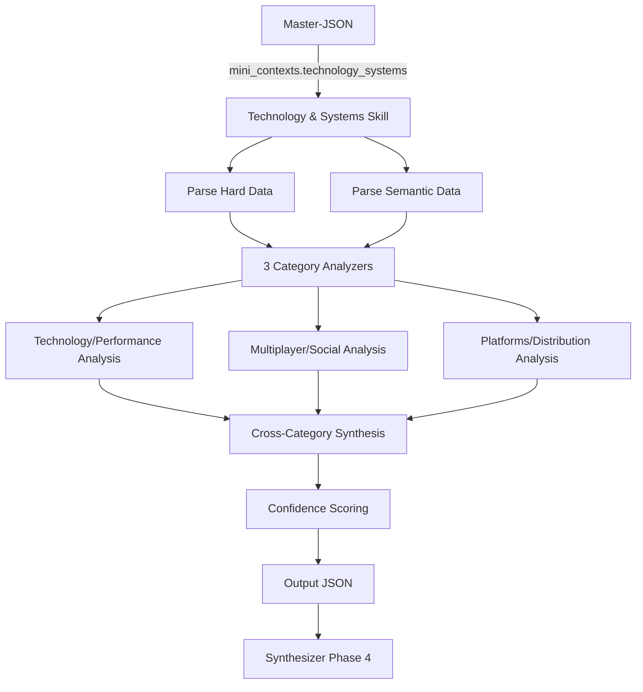

# Technology and Systems — Macro-Skill Specification

> **Artifact:** `tech_systems_skill.yaml`  
> **Repository path:** `openspec/specs/macro_skills/tech_systems_skill.md`  
> **Usage:** Backend Macro-Skill contract for technical and platform analysis  
> **Phase:** Phase 3 (Parallel Analysis)  
> **Macro-Skill:** Technology and Systems  
> **Categories:** Technology/Performance, Multiplayer/Social, Platforms/Distribution  
> **Status:** Draft  
> **Last Updated:** 2026-06-17

---

## 1. Overview

The **Technology and Systems Macro-Skill** is one of four parallel analyzers in the GetSmart pipeline. It receives exclusively the **Technology & Systems Mini-Context** from the Master-JSON and produces structured, professional-grade intelligence covering three thematic categories: Technology/Performance, Multiplayer/Social, and Platforms/Distribution.

**Output purpose:** Feed processed, categorized, and synthesized insights into the Phase 4 Synthesizer. The Synthesizer will combine this with the other three Macro-Skills to produce the final multi-format report.

**Key principle:** This skill **analyzes**, not copies. Raw technical discussions, GitHub repos, StackOverflow threads, and dev blogs are synthesized into actionable intelligence with cited sources.

**Target audience:** Technical directors, engineering leads, platform strategists, and DevOps teams who need to understand technical architecture, performance profile, multiplayer infrastructure, and platform strategy.

---

## 2. Input Contract

### 2.1 Source

| Field | Value |
|-------|-------|
| **Source path** | `mini_contexts.technology_systems` |
| **Schema reference** | `master_json_schema.yaml#/definitions/mini_context_technology_systems` |
| **Data scope** | Hard data + semantic data for Technology & Systems categories only |

### 2.2 Hard Data Received

| Data | Source API | Usage in Analysis |
|------|-----------|-------------------|
| `game_engines` | IGDB | Engine capabilities and technical constraints |
| `platforms` | IGDB | Multi-platform strategy and port quality |
| `multiplayer_modes` | IGDB | Online feature scope |
| `online_coop`, `offline_coop`, `lan_coop` | IGDB | Coop architecture |
| `split_screen` | IGDB | Local multiplayer tech |
| `cross_play` | IGDB | Cross-platform infrastructure |
| `pc_requirements` | Steam Storefront | Hardware accessibility |
| `mac_requirements`, `linux_requirements` | Steam Storefront | Platform parity |
| `current_player_count` | Steam Web API | Live service health |

### 2.3 Semantic Data Received

| Category | Tavily Queries | Expected Platforms |
|----------|---------------|-------------------|
| **Technology/Performance** | engine, performance, rendering, optimization | GitHub, StackOverflow, Reddit, HackerNews |
| **Multiplayer/Social** | netcode, servers, coop technical | GitHub, StackOverflow, Reddit, Dev Blogs |
| **Platforms/Distribution** | ports, requirements, cross-platform | GitHub, StackOverflow, Reddit, HackerNews |

### 2.4 Input Example (Abridged)

```json
{
  "metadata": {
    "game_id": "a1b2c3d4...",
    "game_name": "Elden Ring",
    "macro_skill": "Technology and Systems",
    "worker_id": "scraper_technology_systems",
    "data_sources": ["IGDB", "RAWG", "Steam", "Tavily"]
  },
  "hard_data": {
    "game_engines": ["Proprietary Engine"],
    "platforms": ["PC", "PS4", "PS5", "Xbox One", "Xbox Series X|S"],
    "multiplayer_modes": ["Online Co-op", "Online PvP"],
    "online_coop": true,
    "offline_coop": false,
    "lan_coop": false,
    "split_screen": false,
    "cross_play": false,
    "pc_requirements": {
      "minimum": "OS: Windows 10, Processor: INTEL CORE I5-8400...",
      "recommended": "OS: Windows 10/11, Processor: INTEL CORE I7-8700K..."
    },
    "current_player_count": 45000
  },
  "semantic_data": {
    "technology_performance": {
      "sources": [
        {
          "url": "https://github.com/...",
          "title": "Elden Ring engine analysis",
          "snippet": "FromSoftware's proprietary engine shows evolution from Souls series...",
          "platform": "github"
        }
      ]
    },
    "multiplayer_social": { "sources": [...] },
    "platforms_distribution": { "sources": [...] }
  },
  "evidence_count": 22,
  "confidence_score": 0.80
}
```

---

## 3. Output Contract

### 3.1 Output Structure

```json
{
  "metadata": { ... },
  "analysis": {
    "technology_performance": { ... },
    "multiplayer_social": { ... },
    "platforms_distribution": { ... }
  },
  "summary": { ... },
  "confidence": { ... }
}
```

### 3.2 Output Philosophy

| Principle | Implementation |
|-----------|---------------|
| **Synthesis over transcription** | Raw snippets are analyzed, not pasted. Output contains insights, not quotes. |
| **Source attribution** | Every claim references original URLs for traceability. |
| **Enum discipline** | Ratings and classifications use strict enums (no free text). |
| **Honest gaps** | Low-evidence areas are flagged with reduced confidence scores. |
| **Professional tone** | Written for technical directors and engineers — precise and actionable. |
| **Technical depth** | Include specific technical details (engine versions, API usage, architecture patterns) when evidence supports. |

---

## 4. Category Deep-Dive

### 4.1 Technology/Performance

Analyzes game engine, rendering pipeline, optimization, and technical architecture.

**Key dimensions:**
- **Engine architecture:** Custom vs. commercial engine, version, capabilities
- **Rendering pipeline:** Graphics API (DX12, Vulkan), ray tracing, DLSS/FSR
- **Performance profile:** FPS stability, load times, stuttering, VRAM usage
- **Optimization quality:** CPU/GPU utilization, asset streaming, LOD system
- **Technical debt:** Known issues, patch history, engine limitations

**Output fields:**

| Field | Type | Description |
|-------|------|-------------|
| `overview` | string | Executive summary (2-3 sentences) |
| `engine_architecture` | object | Engine type, version, custom modifications |
| `rendering_pipeline` | object | Graphics API, features, scaling tech |
| `performance_profile` | object | FPS, stability, load times, benchmarks |
| `optimization_quality` | object | Utilization, streaming, LOD, memory |
| `technical_debt` | object | Known issues, patch history, limitations |
| `sources_cited[]` | array | URLs with platform and relevance |

**Enum values:**
- `engine_type`: `proprietary`, `unreal_engine_4`, `unreal_engine_5`, `unity`, `customized_commercial`, `other`
- `graphics_api`: `directx_11`, `directx_12`, `vulkan`, `opengl`, `metal`, `multiple`
- `performance_stability`: `unstable`, `variable`, `stable`, `rock_solid`
- `optimization_rating`: `poor`, `average`, `good`, `excellent`
- `load_time_rating`: `excessive`, `acceptable`, `fast`, `instantaneous`
- `technical_debt_level`: `minimal`, `moderate`, `significant`, `critical`

### 4.2 Multiplayer/Social

Evaluates online infrastructure, netcode, social features, and backend architecture.

**Key dimensions:**
- **Netcode architecture:** P2P, dedicated servers, hybrid, rollback
- **Latency/compensation:** Input lag, hit registration, desync handling
- **Session management:** Matchmaking, lobby system, session stability
- **Social features:** Friends, voice chat, messaging, community tools
- **Anti-cheat:** Solutions deployed, effectiveness, false positive rate
- **Backend scalability:** Server capacity, DDoS resilience, maintenance windows

**Output fields:**

| Field | Type | Description |
|-------|------|-------------|
| `overview` | string | Executive summary |
| `netcode_architecture` | object | Architecture type, implementation quality |
| `latency_compensation` | object | Input lag, hit reg, desync handling |
| `session_management` | object | Matchmaking, lobbies, stability |
| `social_features` | object | Friends, chat, community tools |
| `anti_cheat` | object | Solution, effectiveness, controversies |
| `backend_scalability` | object | Capacity, resilience, maintenance |
| `sources_cited[]` | array | Attributed sources |

**Enum values:**
- `netcode_type`: `p2p`, `dedicated_servers`, `hybrid`, `rollback`, `listen_server`
- `latency_rating`: `unplayable`, `noticeable`, `acceptable`, `imperceptible`
- `matchmaking_quality`: `broken`, `functional`, `good`, `excellent`
- `session_stability`: `frequent_drops`, `occasional_drops`, `stable`, `flawless`
- `social_feature_depth`: `none`, `basic`, `full`, `platform_integrated`
- `anti_cheat_solution`: `none`, `proprietary`, `third_party`, `kernel_level`
- `scalability_rating`: `insufficient`, `adequate`, `good`, `excellent`

### 4.3 Platforms/Distribution

Assesses platform strategy, port quality, distribution channels, and hardware requirements.

**Key dimensions:**
- **Platform parity:** Feature equivalence across PC, console, cloud
- **Port quality:** Resolution, FPS targets, optimization per platform
- **Distribution strategy:** Store exclusivity, Game Pass, subscription services
- **Hardware accessibility:** Minimum specs, recommended specs, scalability
- **Cross-platform:** Save sync, cross-play, cross-progression
- **Patch cadence:** Update frequency, platform certification delays

**Output fields:**

| Field | Type | Description |
|-------|------|-------------|
| `overview` | string | Executive summary |
| `platform_parity` | object | Feature equivalence, version alignment |
| `port_quality` | object | Per-platform resolution, FPS, optimization |
| `distribution_strategy` | object | Stores, exclusivity, subscriptions |
| `hardware_accessibility` | object | Specs, scalability, hardware trends |
| `cross_platform_features` | object | Save sync, cross-play, progression |
| `patch_cadence` | object | Update frequency, certification, rollback |
| `sources_cited[]` | array | Attributed sources |

**Enum values:**
- `parity_level`: `fragmented`, `uneven`, `functional`, `full`
- `port_quality_rating`: `unplayable`, `functional`, `good`, `excellent`
- `distribution_model`: `premium_only`, `subscription_included`, `f2p`, `hybrid`
- `hardware_accessibility`: `demanding`, `moderate`, `accessible`, `universal`
- `cross_play_status`: `not_supported`, `partial`, `full`, `platform_limited`
- `patch_frequency`: `rare`, `occasional`, `regular`, `aggressive`

---

## 5. Cross-Category Summary

The `summary` section synthesizes insights across all three categories into a unified technical assessment.

| Field | Description |
|-------|-------------|
| `technical_philosophy` | Core technical philosophy that unifies all 3 categories (1 paragraph) |
| `standout_strengths` | Top 3-5 technical strengths across all categories |
| `critical_weaknesses` | Top 2-4 technical weaknesses or risks |
| `engineering_risks` | Technical debt, scalability concerns, maintenance burden |
| `competitive_positioning` | How does technical execution compare to genre standards? |
| `future_readiness` | Assessment of architecture for DLC, sequels, live service |

### 5.1 Engineering Risks Structure

```json
{
  "engineering_risks": [
    {
      "risk": "string",
      "category": "technology_performance | multiplayer_social | platforms_distribution",
      "likelihood": "low | medium | high",
      "impact": "low | medium | high | critical",
      "mitigation": "string",
      "timeline_concern": "string"
    }
  ]
}
```

### 5.2 Future Readiness Structure

```json
{
  "future_readiness": {
    "dlc_support": "string",
    "live_service_viability": "string",
    "sequel_reusability": "string",
    "technology_obsolescence_risk": "string",
    "recommended_upgrades": ["string"]
  }
}
```

---

## 6. Confidence System

Every output includes explicit confidence metrics.

| Metric | Range | Description |
|--------|-------|-------------|
| `overall_score` | 0.0–1.0 | Weighted average across categories |
| `category_scores` | 0.0–1.0 each | Per-category confidence |
| `data_quality_notes` | array | Explicit notes on gaps, conflicts, or low-evidence areas |

### 6.1 Confidence Adjustment Rules

| Condition | Adjustment | Rationale |
|-----------|-----------|-----------|
| Evidence count < 3 per category | −0.2 | Insufficient sample |
| Technical sources from unofficial channels | −0.1 | Uncertainty in accuracy |
| Conflicting performance reports | −0.1 + flag | Hardware variance or patch changes |
| No semantic data | Cap at 0.5 | Hard data only |
| Dev blog or postmortem available | +0.05 | Authoritative source |

---

## 7. Anti-Hallucination Strategy

| Guard | Enforcement | Description |
|-------|-------------|-------------|
| **Source Attribution** | Strict | Every claim must cite at least one source URL |
| **Enum Constraint** | Strict | Only predefined enum values allowed |
| **Evidence Threshold** | Automatic | < 3 sources triggers low-confidence flag |
| **No Invented Data** | Strict | No fabricated specs, benchmarks, or architecture details |
| **Confidence Transparency** | Mandatory | Data gaps explicitly documented |
| **Technical Spec Grounding** | Strict | Hardware specs must match official requirements or verified benchmarks |

---

## 8. System Prompt

```
You are the Technology and Systems Analyst for GetSmart, a professional game intelligence platform.

Your role is to analyze the provided Mini-Context (hard data + semantic evidence) and produce
a structured, professional intelligence report covering 3 categories: Technology/Performance,
Multiplayer/Social, and Platforms/Distribution.

## Core Rules:
1. ANALYZE, don't copy. Synthesize evidence into insights. Do not paste raw snippets.
2. Cite sources. Every claim must reference at least one source from the context.
3. Be honest about gaps. If evidence is sparse, state it and adjust confidence scores.
4. Use enums strictly. Only use values defined in the output schema.
5. Target audience: Technical directors, engineering leads, and platform strategists.
6. Be technically precise. Include specific details (API versions, engine features, architecture patterns) when evidence supports.

## Analysis Guidelines:
- Technology/Performance: Focus on engine capabilities, rendering pipeline, optimization quality, benchmarks
- Multiplayer/Social: Analyze netcode, infrastructure, session management, anti-cheat, scalability
- Platforms/Distribution: Evaluate port quality, platform parity, distribution strategy, hardware accessibility

## Tone:
Professional, technically precise, risk-aware. Identify technical debt and scalability concerns.
Reference specific comparable titles for architecture comparisons when evidence supports.
```

---

## 9. Model Configuration

| Parameter | Value |
|-----------|-------|
| **Model** | Gemini-2.5-flash |
| **Provider** | Google |
| **Temperature** | 0.3 |
| **Max Output Tokens** | 6,000 |
| **Context Window** | 2M tokens |
| **Top-P** | 0.95 |
| **Top-K** | 40 |

**Temperature rationale:** Low temperature (0.3) ensures consistent, deterministic analysis while allowing sufficient creativity for synthesis.

---

## 10. Chunking Strategy

| Strategy | Description |
|----------|-------------|
| **Primary** | Single-pass analysis (full Mini-Context fits in 2M tokens) |
| **Fallback** | Category-sequential if input exceeds 1.8M tokens |

**Category-sequential method:** Analyze each category independently, passing hard_data + relevant semantic_data subset per call.

---

## 11. Caching

| Aspect | Configuration |
|--------|---------------|
| **Enabled** | Yes |
| **Key format** | `skill:technology_systems:{game_id}:{input_hash}` |
| **TTL** | 24 hours |
| **Invalidation** | Master-JSON version change or new evidence |

---

## 12. Error Handling

### 12.1 Retry Policy

| Parameter | Value |
|-----------|-------|
| Max retries | 3 |
| Backoff | Exponential |
| Initial delay | 1s |
| Max delay | 30s |

### 12.2 Fallback Output

If all retries fail, return a minimal valid structure with `error: true` flags and zero confidence scores. The Synthesizer will handle gracefully.

```json
{
  "metadata": {
    "skill_id": "technology_systems",
    "skill_name": "Technology and Systems",
    "generated_at": "ISO8601",
    "model_used": "gemini-2.5-flash"
  },
  "analysis": {
    "technology_performance": { "category_id": "technology_performance", "category_name": "Technology/Performance", "overview": "Analysis failed", "error": true },
    "multiplayer_social": { "category_id": "multiplayer_social", "category_name": "Multiplayer/Social", "overview": "Analysis failed", "error": true },
    "platforms_distribution": { "category_id": "platforms_distribution", "category_name": "Platforms/Distribution", "overview": "Analysis failed", "error": true }
  },
  "summary": {
    "technical_philosophy": "Analysis could not be completed due to system error.",
    "standout_strengths": [],
    "critical_weaknesses": [],
    "engineering_risks": [],
    "future_readiness": { "dlc_support": "unknown", "live_service_viability": "unknown", "sequel_reusability": "unknown", "technology_obsolescence_risk": "unknown", "recommended_upgrades": [] }
  },
  "confidence": {
    "overall_score": 0.0,
    "category_scores": {
      "technology_performance": 0.0,
      "multiplayer_social": 0.0,
      "platforms_distribution": 0.0
    },
    "data_quality_notes": ["System error prevented analysis."]
  }
}
```

---

## 13. Flow Diagram



---

## 14. Example: Complete Output for "Elden Ring"

### 14.1 Metadata

```json
{
  "skill_id": "technology_systems",
  "skill_name": "Technology and Systems",
  "game_id": "a1b2c3d4-e5f6-7890-abcd-ef1234567890",
  "game_name": "Elden Ring",
  "generated_at": "2026-06-17T15:15:00Z",
  "model_used": "gemini-2.5-flash",
  "input_evidence_count": 22,
  "input_confidence_score": 0.80
}
```

### 14.2 Technology/Performance Analysis

```json
{
  "category_id": "technology_performance",
  "category_name": "Technology/Performance",
  "overview": "Elden Ring runs on an evolved version of FromSoftware's proprietary engine, first seen in Dark Souls III and refined through Sekiro. The engine shows its age in asset streaming and LOD transitions but delivers stable performance on recommended hardware.",
  "engine_architecture": {
    "engine_type": "proprietary",
    "engine_name": "FromSoftware Proprietary Engine (evolved from DS3/Sekiro)",
    "custom_modifications": "Open-world streaming system added for Elden Ring. Expanded memory management for larger environments.",
    "known_limitations": "32-bit executable limitations addressed in patches. Memory leak issues on PC at launch (patched)."
  },
  "rendering_pipeline": {
    "graphics_api": "directx_12",
    "ray_tracing": false,
    "dlss_fsr": "none",
    "resolution_scaling": "Internal resolution scaler on console. No DLSS/FSR at launch.",
    "notable_features": "Dynamic weather system, global illumination approximations, large draw distances for open world."
  },
  "performance_profile": {
    "pc_benchmarks": "60 FPS at 1080p/High on RTX 2060 Super. 4K/60 requires RTX 3080 or equivalent.",
    "console_performance": "PS5/XSX: Performance mode 1080p/60fps (unstable). Quality mode 4K/30-45fps (variable).",
    "stability": "Stuttering issues on PC at launch due to shader compilation. Patched but not fully resolved. Console more stable.",
    "load_times": "PS5 SSD: ~3-5 seconds. PC SATA SSD: ~8-12 seconds. HDD: 20+ seconds."
  },
  "optimization_quality": {
    "cpu_utilization": "Moderate. CPU-bound in legacy dungeons with many enemies. GPU-bound in open world.",
    "gpu_utilization": "Good on high-end cards. Mid-range cards struggle at 4K. VRAM usage: 6-8GB at 4K.",
    "asset_streaming": "Pop-in visible on horseback at high speeds. Texture streaming causes brief blur on console.",
    "lod_system": "Aggressive LOD transitions noticeable on distant geometry. Tree pop-in is a common complaint."
  },
  "technical_debt": {
    "debt_level": "moderate",
    "known_issues": [
      "PC stuttering from shader compilation (partially patched)",
      "Memory leaks in long play sessions (patched)",
      "Frame pacing inconsistencies on console quality mode",
      "Limited ultrawide support (black bars)"
    ],
    "patch_history": "Launch day patch addressed critical crashes. Patch 1.02 improved PC stability. Patch 1.04 fixed memory leaks.",
    "engine_limitations": "Proprietary engine lacks modern features like DLSS, ray tracing, or advanced streaming. FromSoftware has historically avoided middleware."
  },
  "sources_cited": [
    {
      "url": "https://github.com/...",
      "platform": "github",
      "relevance": "Engine reverse-engineering analysis"
    },
    {
      "url": "https://reddit.com/r/pcgaming/comments/...",
      "platform": "reddit",
      "relevance": "PC performance benchmarks and issues"
    }
  ]
}
```

### 14.3 Multiplayer/Social Analysis

```json
{
  "category_id": "multiplayer_social",
  "category_name": "Multiplayer/Social",
  "overview": "Elden Ring inherits Dark Souls' asynchronous multiplayer DNA with cooperative summoning and invasive PvP. The netcode is peer-to-peer with noticeable latency limitations, but the design philosophy treats multiplayer as an ambient spice rather than core infrastructure.",
  "netcode_architecture": {
    "netcode_type": "p2p",
    "implementation_quality": "Functional but dated. Same P2P model since Dark Souls.",
    "latency_handling": "No rollback netcode. High-latency connections result in teleporting enemies and delayed hit registration.",
    "host_advantage": "Host has significant advantage in PvP due to P2P architecture."
  },
  "latency_compensation": {
    "input_lag": "Noticeable in co-op with distant hosts. ~100-200ms perceived delay.",
    "hit_registration": "Inconsistent. Backstabs and parries are particularly sensitive to latency.",
    "desync_handling": "Minimal. Players may see different enemy positions. No client-side prediction for melee."
  },
  "session_management": {
    "matchmaking": "Level-based with weapon upgrade memory. Password system for friend co-op.",
    "lobby_system": "No traditional lobbies. Summon signs appear in shared world spaces.",
    "session_stability": "occasional_drops",
    "session_notes": "Co-op sessions terminate after boss defeat. Invasions end on host death or invader defeat."
  },
  "social_features": {
    "friends_integration": "basic",
    "voice_chat": "none",
    "messaging": "none",
    "community_tools": "Player messages (asynchronous), bloodstains (death replays), phantoms (ghost players)",
    "notes": "Social features are diegetic and atmospheric rather than utilitarian. No party system or guilds."
  },
  "anti_cheat": {
    "anti_cheat_solution": "proprietary",
    "solution_name": "FromSoftware internal anti-cheat (Easy Anti-Cheat on PC)",
    "effectiveness": "Moderate. Item injection and stat editing persist. Speed hacks and invincibility glitches patched.",
    "controversies": "Easy Anti-Cheat caused performance issues on PC at launch. Some Linux/Steam Deck compatibility issues.",
    "false_positives": "Rare but documented. Some overlay software triggered bans (later resolved)."
  },
  "backend_scalability": {
    "server_capacity": "Not applicable — P2P architecture means no dedicated server capacity constraints.",
    "matchmaking_infrastructure": "Steam/PlayStation Network/Xbox Live matchmaking services. No proprietary backend.",
    "maintenance_windows": "Minimal. Server maintenance only required for patch deployment.",
    "ddos_resilience": "High — no centralized servers to target. P2P sessions are distributed."
  },
  "sources_cited": [
    {
      "url": "https://reddit.com/r/Eldenring/comments/...",
      "platform": "reddit",
      "relevance": "Multiplayer latency and netcode discussion"
    },
    {
      "url": "https://hackernews.com/...",
      "platform": "hackernews",
      "relevance": "Technical analysis of P2P architecture"
    }
  ]
}
```

### 14.4 Platforms/Distribution Analysis

```json
{
  "category_id": "platforms_distribution",
  "category_name": "Platforms/Distribution",
  "overview": "Day-one release across PC (Steam), PlayStation 4/5, and Xbox One/Series X|S. No platform exclusivity or subscription inclusion. PC version suffered launch issues but achieved parity post-patches.",
  "platform_parity": {
    "parity_level": "functional",
    "feature_equivalence": "All platforms have identical content. PC has mod support (unofficial). Console has haptic feedback on DualSense.",
    "version_alignment": "Patches release simultaneously across all platforms. No content delays.",
    "notes": "PC version initially had more bugs. Console versions more stable at launch."
  },
  "port_quality": {
    "pc": {
      "resolution": "Up to 4K native (no DLSS/FSR)",
      "fps_target": "60 FPS (uncapped possible with mods)",
      "optimization": "Good on recommended specs. Stuttering issues at launch (patched).",
      "rating": "good"
    },
    "ps5": {
      "resolution": "Performance: 1080p dynamic. Quality: 4K dynamic.",
      "fps_target": "Performance: 60fps (unstable). Quality: 30-45fps.",
      "optimization": "PS5 SSD reduces load times significantly. DualSense haptic feedback supported.",
      "rating": "good"
    },
    "xbox_series_x": {
      "resolution": "Equivalent to PS5",
      "fps_target": "Equivalent to PS5",
      "optimization": "Quick Resume supported. Smart Delivery enabled.",
      "rating": "good"
    },
    "ps4_xbox_one": {
      "resolution": "1080p with dynamic scaling",
      "fps_target": "30fps (with drops in dense areas)",
      "optimization": "Functional but clearly constrained by hardware. Texture pop-in more severe.",
      "rating": "functional"
    }
  },
  "distribution_strategy": {
    "stores": ["Steam (PC)", "PlayStation Store", "Microsoft Store", "Xbox Store"],
    "exclusivity": "none",
    "subscription_services": "Not included in Game Pass or PS Plus at launch. Available for purchase only.",
    "retail": "Physical editions available for console. PC is digital-only.",
    "notes": "No Epic Games Store exclusivity. No cloud gaming service integration (GeForce NOW, xCloud) at launch."
  },
  "hardware_accessibility": {
    "minimum_specs": "Intel i5-8400 / AMD Ryzen 3 3300X, 12GB RAM, GTX 1060 3GB",
    "recommended_specs": "Intel i7-8700K / AMD Ryzen 5 3600X, 16GB RAM, GTX 1070 8GB",
    "scalability": "Moderate. Minimum specs run at 720p/low/30fps. Recommended specs achieve 1080p/high/60fps.",
    "storage_required": "60GB",
    "ssd_recommended": true,
    "notes": "SSD strongly recommended due to open-world streaming. HDD causes texture pop-in and longer loads."
  },
  "cross_platform_features": {
    "save_sync": "Not supported. Saves are platform-locked.",
    "cross_play": "Not supported.",
    "cross_progression": "Not supported.",
    "notes": "No cross-platform features of any kind. Each platform is a completely isolated ecosystem."
  },
  "patch_cadence": {
    "update_frequency": "regular",
    "major_patches": "Approximately every 4-6 weeks during first 6 months.",
    "hotfix_speed": "Critical fixes within 48-72 hours. Balance patches within 2 weeks.",
    "certification_delays": "Console patches require certification (~3-5 days). PC patches can be immediate.",
    "rollback_capability": "No public rollback system. Patches are forward-only."
  },
  "sources_cited": [
    {
      "url": "https://store.steampowered.com/app/1245620/...",
      "platform": "press",
      "relevance": "Official system requirements"
    },
    {
      "url": "https://reddit.com/r/pcgaming/comments/...",
      "platform": "reddit",
      "relevance": "Platform comparison and port quality"
    }
  ]
}
```

### 14.5 Cross-Category Summary

```json
{
  "technical_philosophy": "FromSoftware's technical approach prioritizes artistic vision over cutting-edge technology. The proprietary engine, while aging, is deeply understood by the team and enables rapid iteration. Multiplayer is treated as an atmospheric layer rather than core infrastructure, reflecting the studio's single-player heritage. Platform strategy is conservative — maximum reach through multi-platform release without experimental distribution models.",
  "standout_strengths": [
    "Mature proprietary engine with deep institutional knowledge",
    "Multi-platform day-one release with content parity",
    "P2P architecture eliminates ongoing server costs",
    "PS5 SSD integration reduces load times significantly",
    "Conservative hardware requirements enable broad accessibility"
  ],
  "critical_weaknesses": [
    "Aging engine lacks modern features (DLSS, ray tracing, advanced streaming)",
    "P2P netcode creates latency and cheating vulnerabilities",
    "PC launch stability issues damaged reputation (since recovered)",
    "No cross-platform features limit player mobility",
    "Limited ultrawide and high-refresh-rate support on PC"
  ],
  "engineering_risks": [
    {
      "risk": "Proprietary engine may not scale for next-generation open-world projects",
      "category": "technology_performance",
      "likelihood": "medium",
      "impact": "high",
      "mitigation": "Evaluate Unreal Engine 5 or major engine overhaul for next title",
      "timeline_concern": "Next project (Elden Ring 2 or new IP)"
    },
    {
      "risk": "P2P architecture limits live service and competitive multiplayer potential",
      "category": "multiplayer_social",
      "likelihood": "high",
      "impact": "medium",
      "mitigation": "Invest in dedicated server infrastructure for future multiplayer-focused titles",
      "timeline_concern": "If expanding multiplayer in DLC or sequel"
    },
    {
      "risk": "Console generation transition may leave last-gen ports behind",
      "category": "platforms_distribution",
      "likelihood": "medium",
      "impact": "medium",
      "mitigation": "Phase out PS4/Xbox One support for future titles; focus on current-gen",
      "timeline_concern": "2025-2026"
    }
  ],
  "competitive_positioning": {
    "genre_benchmark": "Technically conservative compared to peers. Games like Horizon Forbidden West and God of War Ragnarok push significantly more advanced rendering and engine features. However, FromSoftware's technical efficiency enables faster development cycles and lower budgets.",
    "unique_selling_points": [
      "Proprietary engine enables rapid iteration and unique feel",
      "P2P multiplayer eliminates server maintenance burden",
      "Broad hardware compatibility maximizes market reach"
    ],
    "comparable_titles": [
      "Dark Souls III (same engine generation)",
      "Sekiro: Shadows Die Twice (engine evolution)",
      "Horizon Forbidden West (opposite philosophy — cutting-edge tech)"
    ]
  },
  "future_readiness": {
    "dlc_support": "Engine supports DLC injection. Shadow of the Erdtree expansion confirmed. Asset pipeline proven.",
    "live_service_viability": "Low. P2P architecture and lack of backend infrastructure make live service expansion difficult. Would require significant engineering investment.",
    "sequel_reusability": "High. Engine and tools are mature. Team has deep expertise. Elden Ring 2 could reuse 70%+ of technical infrastructure.",
    "technology_obsolescence_risk": "Medium. Engine lacks modern rendering features. Competitors are adopting UE5. Risk of visual stagnation if not upgraded.",
    "recommended_upgrades": [
      "Evaluate Unreal Engine 5 or major proprietary engine overhaul",
      "Implement DLSS/FSR for PC performance",
      "Investigate dedicated server infrastructure for expanded multiplayer",
      "Add ray tracing for next-gen visual parity",
      "Implement cross-progression for player retention"
    ]
  }
}
```

### 14.6 Confidence Metrics

```json
{
  "overall_score": 0.80,
  "category_scores": {
    "technology_performance": 0.85,
    "multiplayer_social": 0.75,
    "platforms_distribution": 0.82
  },
  "data_quality_notes": [
    "Strong technical sources from GitHub reverse-engineering and benchmark sites",
    "Multiplayer analysis limited by proprietary netcode (no public documentation)",
    "Platform data partially inferred from official specs and community benchmarks",
    "Some performance data may be outdated due to post-launch patches"
  ]
}
```

---

## 15. Glossary

| Term | Definition |
|------|------------|
| **Mini-Context** | Structured JSON produced by a scraper worker, containing hard and semantic data |
| **Hard Data** | Structured data from direct APIs (IGDB, RAWG, Steam) |
| **Semantic Data** | Unstructured data from web searches (Tavily) |
| **Macro-Skill** | Analysis cluster (Design & Art, UX, Tech & Systems, Strategy & Market) |
| **Synthesizer** | Phase 4 module that unifies all 4 Macro-Skill outputs into final report |
| **Evidence Count** | Number of semantic sources collected for a category |
| **Confidence Score** | [0-1] metric indicating evidence quality and analytical certainty |
| **P2P** | Peer-to-Peer — network architecture where clients connect directly |
| **Netcode** | Networking code that handles multiplayer synchronization |
| **Rollback** | Netcode technique that rewinds game state to resolve latency |
| **DLSS/FSR** | Deep Learning Super Sampling / FidelityFX Super Resolution — upscaling tech |
| **LOD** | Level of Detail — technique for reducing geometry complexity at distance |
| **VRAM** | Video RAM — GPU memory for textures and framebuffers |
| **API** | Application Programming Interface — e.g., DirectX, Vulkan |
| **SSD** | Solid State Drive — fast storage device |

---

*Document generated 2026-06-17 as part of GetSmart v3.0*
