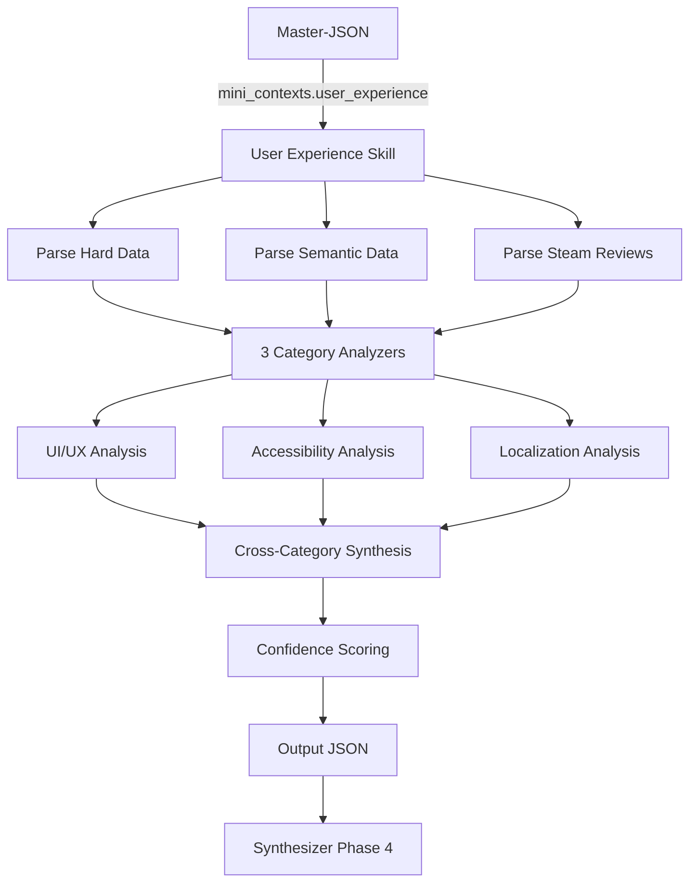

# User Experience — Macro-Skill Specification

> **Artifact:** `ux_skill.yaml`  
> **Repository path:** `openspec/specs/macro_skills/ux_skill.md`  
> **Usage:** Backend Macro-Skill contract for UX, Accessibility, Localization  
> **Phase:** Phase 3 (Parallel Analysis)  
> **Macro-Skill:** User Experience  
> **Categories:** UI/UX, Accessibility, Localization  
> **Status:** Draft  
> **Last Updated:** 2026-06-17

---

## 1. Overview

The **User Experience Macro-Skill** is one of four parallel analyzers in the GetSmart pipeline. It receives exclusively the **User Experience Mini-Context** from the Master-JSON and produces structured, professional-grade intelligence covering three thematic categories: UI/UX, Accessibility, and Localization.

**Output purpose:** Feed processed, categorized, and synthesized insights into the Phase 4 Synthesizer. The Synthesizer will combine this with the other three Macro-Skills to produce the final multi-format report.

**Key principle:** This skill **analyzes**, not copies. Raw social media snippets, Steam reviews, and forum posts are synthesized into actionable intelligence with cited sources.

**Target audience:** Directors, producers, UX designers, and QA leads who need to understand player friction points, accessibility gaps, and regional market readiness.

---

## 2. Input Contract

### 2.1 Source

| Field | Value |
|-------|-------|
| **Source path** | `mini_contexts.user_experience` |
| **Schema reference** | `master_json_schema.yaml#/definitions/mini_context_user_experience` |
| **Data scope** | Hard data + semantic data for UX categories only |

### 2.2 Hard Data Received

| Data | Source API | Usage in Analysis |
|------|-----------|-------------------|
| `platforms` | IGDB | Multi-platform UX consistency assessment |
| `languages_supported` | IGDB | Localization coverage baseline |
| `system_requirements` | Steam Storefront | Hardware accessibility barriers |
| `controller_support` | Steam Storefront | Input method options |
| `full_controller_support` | Steam Storefront | Console-like UX on PC |
| `steam_cloud` | Steam Storefront | Save portability |
| `steam_achievements` | Steam Storefront | Progress tracking UX |

### 2.3 Semantic Data Received

| Category | Tavily Queries | Expected Platforms |
|----------|---------------|-------------------|
| **UI/UX** | UI design, usability, HUD, menus | Reddit, Steam Reviews, StackOverflow |
| **Accessibility** | accessibility, disability, colorblind | Reddit, Steam Reviews, Forums |
| **Localization** | translation, language, regional | Reddit, Steam Reviews, Forums |

**Extra data:** `steam_reviews_sample` — Direct player feedback with playtime, language, and sentiment metadata.

### 2.4 Input Example (Abridged)

```json
{
  "metadata": {
    "game_id": "a1b2c3d4...",
    "game_name": "Elden Ring",
    "macro_skill": "User Experience",
    "worker_id": "scraper_user_experience",
    "data_sources": ["IGDB", "Steam", "Tavily"]
  },
  "hard_data": {
    "platforms": ["PC", "PS4", "PS5", "Xbox One", "Xbox Series X|S"],
    "languages_supported": ["English", "French", "German", "Italian", "Japanese", "Korean", "Polish", "Portuguese", "Russian", "Spanish", "Thai", "Chinese"],
    "system_requirements": {
      "minimum": "OS: Windows 10...",
      "recommended": "OS: Windows 10/11..."
    },
    "controller_support": true,
    "full_controller_support": true,
    "steam_cloud": true,
    "steam_achievements": true
  },
  "semantic_data": {
    "ui_ux": {
      "sources": [
        {
          "url": "https://reddit.com/r/gaming/...",
          "title": "Elden Ring UI complaints",
          "snippet": "The inventory system is clunky and requires too many button presses...",
          "platform": "reddit"
        }
      ]
    },
    "accessibility": { "sources": [...] },
    "localization": { "sources": [...] },
    "steam_reviews_sample": {
      "positive_count": 950000,
      "negative_count": 50000,
      "review_score": 0.95,
      "sample_reviews": [
        {
          "review": "Best game I've ever played but the menus are terrible...",
          "voted_up": true,
          "playtime_hours": 120.5,
          "language": "english"
        }
      ]
    }
  },
  "evidence_count": 18,
  "confidence_score": 0.78
}
```

---

## 3. Output Contract

### 3.1 Output Structure

```json
{
  "metadata": { ... },
  "analysis": {
    "ui_ux": { ... },
    "accessibility": { ... },
    "localization": { ... }
  },
  "summary": { ... },
  "confidence": { ... }
}
```

### 3.2 Output Philosophy

| Principle | Implementation |
|-----------|---------------|
| **Synthesis over transcription** | Raw snippets are analyzed, not pasted. Output contains insights, not quotes. |
| **Source attribution** | Every claim references original URLs for traceability. |
| **Enum discipline** | Ratings and classifications use strict enums (no free text). |
| **Honest gaps** | Low-evidence areas are flagged with reduced confidence scores. |
| **Professional tone** | Written for UX designers and producers — concise and actionable. |
| **Player-centric** | Prioritize player pain points and friction reduction opportunities. |

---

## 4. Category Deep-Dive

### 4.1 UI/UX

Analyzes interface design, usability, navigation flow, and player interaction friction.

**Key dimensions:**
- **Interface design:** Visual clarity, information hierarchy, aesthetic integration
- **Navigation flow:** Menu depth, button presses required, learning curve
- **HUD effectiveness:** Information density, customization options, clutter
- **Input responsiveness:** Controller vs. keyboard-mouse parity, input lag
- **Onboarding quality:** Tutorial effectiveness, progressive disclosure
- **Player friction points:** Recurring complaints, workflow inefficiencies

**Output fields:**

| Field | Type | Description |
|-------|------|-------------|
| `overview` | string | Executive summary (2-3 sentences) |
| `interface_design` | object | Visual clarity, hierarchy, aesthetic integration |
| `navigation_flow` | object | Menu structure, efficiency, learning curve |
| `hud_effectiveness` | object | Information density, customization, clutter |
| `input_responsiveness` | object | Controller/KBM parity, lag, remapping |
| `onboarding_quality` | object | Tutorial design, progressive disclosure |
| `friction_points` | array | Recurring player complaints with severity |
| `sources_cited[]` | array | URLs with platform and relevance |

**Enum values:**
- `visual_clarity`: `poor`, `average`, `good`, `excellent`
- `information_hierarchy`: `confusing`, `functional`, `clear`, `intuitive`
- `menu_efficiency`: `cumbersome`, `acceptable`, `efficient`, `streamlined`
- `learning_curve`: `steep`, `moderate`, `gentle`, `invisible`
- `hud_customization`: `none`, `limited`, `moderate`, `extensive`
- `input_parity`: `poor`, `uneven`, `good`, `seamless`
- `tutorial_effectiveness`: `insufficient`, `adequate`, `good`, `exemplary`
- `friction_severity`: `minor`, `moderate`, `major`, `critical`

### 4.2 Accessibility

Evaluates disability support, inclusivity features, and barrier reduction.

**Key dimensions:**
- **Visual accessibility:** Colorblind modes, text size, contrast options
- **Motor accessibility:** Control remapping, one-handed modes, adaptive controller support
- **Cognitive accessibility:** Difficulty options, UI simplification, pause functionality
- **Auditory accessibility:** Subtitles, visual sound cues, closed captions
- **Platform accessibility:** Screen reader support, high contrast modes
- **Compliance gaps:** Missing features vs. industry standards (XAG, CVAA)

**Output fields:**

| Field | Type | Description |
|-------|------|-------------|
| `overview` | string | Executive summary |
| `visual_accessibility` | object | Colorblind, text size, contrast, UI scale |
| `motor_accessibility` | object | Remapping, adaptive controllers, input alternatives |
| `cognitive_accessibility` | object | Difficulty options, UI simplification, guidance |
| `auditory_accessibility` | object | Subtitles, visual cues, caption quality |
| `platform_accessibility` | object | Screen readers, OS-level integration |
| `compliance_assessment` | object | Standards compliance, gaps, recommendations |
| `sources_cited[]` | array | Attributed sources |

**Enum values:**
- `feature_availability`: `not_present`, `partial`, `full`, `industry_leading`
- `colorblind_support`: `none`, `basic`, `comprehensive`
- `subtitle_quality`: `none`, `basic`, `good`, `excellent`
- `remapping_depth`: `none`, `presets_only`, `full`, `per_action`
- `difficulty_options`: `none`, `preset_modes`, `granular`, `adaptive`
- `compliance_level`: `non_compliant`, `partial`, `compliant`, `exemplary`

### 4.3 Localization

Assesses translation quality, cultural adaptation, and regional market readiness.

**Key dimensions:**
- **Language coverage:** Number of languages, major market inclusion
- **Translation quality:** Accuracy, naturalness, consistency
- **Cultural adaptation:** Idioms, references, regional sensitivities
- **Technical localization:** Text overflow, font support, RTL languages
- **Regional pricing:** Price points by market, purchasing power parity
- **Community reception:** Per-language player feedback, bug reports

**Output fields:**

| Field | Type | Description |
|-------|------|-------------|
| `overview` | string | Executive summary |
| `language_coverage` | object | Supported languages, major gaps, priority additions |
| `translation_quality` | object | Accuracy, naturalness, consistency per language |
| `cultural_adaptation` | object | Regional sensitivity, references, idioms |
| `technical_localization` | object | Text rendering, fonts, RTL, UI overflow |
| `regional_pricing` | object | Price comparison, PPP analysis, regional strategy |
| `community_reception` | object | Per-language feedback, common complaints |
| `sources_cited[]` | array | Attributed sources |

**Enum values:**
- `translation_rating`: `poor`, `average`, `good`, `excellent`, `native_quality`
- `cultural_sensitivity`: `insensitive`, `neutral`, `respectful`, `authentic`
- `technical_readiness`: `broken`, `functional`, `polished`, `seamless`
- `pricing_strategy`: `uniform`, `regionalized`, `tiered`, `emerging_market_friendly`

---

## 5. Cross-Category Summary

The `summary` section synthesizes insights across all three categories into a unified UX assessment.

| Field | Description |
|-------|-------------|
| `ux_philosophy` | Core UX philosophy that unifies all 3 categories (1 paragraph) |
| `standout_strengths` | Top 3-5 UX strengths across all categories |
| `critical_weaknesses` | Top 2-4 UX weaknesses or improvement areas |
| `target_audience_alignment` | Who is this UX designed for? What barriers exist? |
| `competitive_positioning` | How does UX compare to genre standards? |
| `priority_recommendations` | Ranked list of highest-impact UX improvements |

### 5.1 Priority Recommendations Structure

```json
{
  "priority_recommendations": [
    {
      "recommendation": "string",
      "category": "ui_ux | accessibility | localization",
      "impact": "low | medium | high | critical",
      "effort": "low | medium | high",
      "roi_rationale": "string"
    }
  ]
}
```

---

## 6. Confidence System

Every output includes explicit confidence metrics.

| Metric | Range | Description |
|--------|-------|-------------|
| `overall_score` | 0.0–1.0 | Weighted average across categories |
| `category_scores` | 0.0–1.0 each | Per-category confidence |
| `data_quality_notes` | array | Explicit notes on gaps, conflicts, or low-evidence areas |

### 6.1 Confidence Adjustment Rules

| Condition | Adjustment | Rationale |
|-----------|-----------|-----------|
| Evidence count < 3 per category | −0.2 | Insufficient sample |
| Steam review sample < 50 reviews | −0.1 | Limited direct player feedback |
| Conflicting sources | −0.1 + flag | Uncertainty in consensus |
| No semantic data | Cap at 0.5 | Hard data only |
| High consensus across sources | +0.05 (max 1.0) | Strong agreement |

---

## 7. Anti-Hallucination Strategy

| Guard | Enforcement | Description |
|-------|-------------|-------------|
| **Source Attribution** | Strict | Every claim must cite at least one source URL |
| **Enum Constraint** | Strict | Only predefined enum values allowed |
| **Evidence Threshold** | Automatic | < 3 sources triggers low-confidence flag |
| **No Invented Data** | Strict | No fabricated scores, quotes, or figures |
| **Confidence Transparency** | Mandatory | Data gaps explicitly documented |
| **Steam Review Grounding** | Strict | UX claims must align with Steam review sentiment when available |

---

## 8. System Prompt

```
You are the User Experience Analyst for GetSmart, a professional game intelligence platform.

Your role is to analyze the provided Mini-Context (hard data + semantic evidence) and produce
a structured, professional intelligence report covering 3 categories: UI/UX, Accessibility,
and Localization.

## Core Rules:
1. ANALYZE, don't copy. Synthesize evidence into insights. Do not paste raw snippets.
2. Cite sources. Every claim must reference at least one source from the context.
3. Be honest about gaps. If evidence is sparse, state it and adjust confidence scores.
4. Use enums strictly. Only use values defined in the output schema.
5. Target audience: UX designers, producers, and QA leads who need actionable intelligence.
6. Prioritize player friction. Focus on what causes player drop-off or negative sentiment.

## Analysis Guidelines:
- UI/UX: Focus on menu efficiency, HUD clarity, input responsiveness, onboarding flow
- Accessibility: Evaluate against Xbox Accessibility Guidelines (XAG) and CVAA standards
- Localization: Assess translation quality, cultural sensitivity, technical readiness, regional pricing

## Tone:
Professional, empathetic to players, solution-oriented. Identify problems but also propose
improvement directions. Use specific examples from evidence. When comparing to industry
standards, reference specific accessible games (e.g., The Last of Us Part II, Forza Horizon 5).
```

---

## 9. Model Configuration

| Parameter | Value |
|-----------|-------|
| **Model** | Gemini-2.5-flash |
| **Provider** | Google |
| **Temperature** | 0.3 |
| **Max Output Tokens** | 6,000 |
| **Context Window** | 2M tokens |
| **Top-P** | 0.95 |
| **Top-K** | 40 |

**Temperature rationale:** Low temperature (0.3) ensures consistent, deterministic analysis while allowing sufficient creativity for synthesis.

---

## 10. Chunking Strategy

| Strategy | Description |
|----------|-------------|
| **Primary** | Single-pass analysis (full Mini-Context fits in 2M tokens) |
| **Fallback** | Category-sequential if input exceeds 1.8M tokens |

**Category-sequential method:** Analyze each category independently, passing hard_data + relevant semantic_data subset per call.

---

## 11. Caching

| Aspect | Configuration |
|--------|---------------|
| **Enabled** | Yes |
| **Key format** | `skill:user_experience:{game_id}:{input_hash}` |
| **TTL** | 24 hours |
| **Invalidation** | Master-JSON version change or new evidence |

---

## 12. Error Handling

### 12.1 Retry Policy

| Parameter | Value |
|-----------|-------|
| Max retries | 3 |
| Backoff | Exponential |
| Initial delay | 1s |
| Max delay | 30s |

### 12.2 Fallback Output

If all retries fail, return a minimal valid structure with `error: true` flags and zero confidence scores. The Synthesizer will handle gracefully.

```json
{
  "metadata": {
    "skill_id": "user_experience",
    "skill_name": "User Experience",
    "generated_at": "ISO8601",
    "model_used": "gemini-2.5-flash"
  },
  "analysis": {
    "ui_ux": { "category_id": "ui_ux", "category_name": "UI/UX", "overview": "Analysis failed", "error": true },
    "accessibility": { "category_id": "accessibility", "category_name": "Accessibility", "overview": "Analysis failed", "error": true },
    "localization": { "category_id": "localization", "category_name": "Localization", "overview": "Analysis failed", "error": true }
  },
  "summary": {
    "ux_philosophy": "Analysis could not be completed due to system error.",
    "standout_strengths": [],
    "critical_weaknesses": [],
    "priority_recommendations": []
  },
  "confidence": {
    "overall_score": 0.0,
    "category_scores": {
      "ui_ux": 0.0,
      "accessibility": 0.0,
      "localization": 0.0
    },
    "data_quality_notes": ["System error prevented analysis."]
  }
}
```

---

## 13. Flow Diagram



---

## 14. Example: Complete Output for "Elden Ring"

### 14.1 Metadata

```json
{
  "skill_id": "user_experience",
  "skill_name": "User Experience",
  "game_id": "a1b2c3d4-e5f6-7890-abcd-ef1234567890",
  "game_name": "Elden Ring",
  "generated_at": "2026-06-17T15:15:00Z",
  "model_used": "gemini-2.5-flash",
  "input_evidence_count": 18,
  "input_confidence_score": 0.78
}
```

### 14.2 UI/UX Analysis

```json
{
  "category_id": "ui_ux",
  "category_name": "UI/UX",
  "overview": "Functional but dated interface design that prioritizes atmospheric immersion over usability efficiency. Menu navigation requires excessive button presses and lacks modern UX conveniences.",
  "interface_design": {
    "visual_clarity": "average",
    "information_hierarchy": "functional",
    "aesthetic_integration": "The UI adopts a parchment/map aesthetic that aligns with the fantasy theme but reduces readability. Text is small on high-resolution displays."
  },
  "navigation_flow": {
    "menu_efficiency": "cumbersome",
    "learning_curve": "steep",
    "button_presses_required": "High — equipping items requires 4+ button presses. No quick-equip favorites system at launch."
  },
  "hud_effectiveness": {
    "information_density": "moderate",
    "customization": "limited",
    "clutter": "Minimal HUD supports immersion but lacks health bar customization and status effect visibility."
  },
  "input_responsiveness": {
    "controller_kbm_parity": "uneven",
    "input_lag": "Minor input buffering issues reported, particularly on dodge rolls.",
    "remapping": "Full controller remapping available; keyboard rebinding is functional but not per-action granular."
  },
  "onboarding_quality": {
    "tutorial_effectiveness": "insufficient",
    "progressive_disclosure": "Minimal guidance. Players are dropped into the world with basic controls only. Systems like crafting, spirit ashes, and weapon scaling are never explicitly explained."
  },
  "friction_points": [
    {
      "issue": "Inventory management requires excessive navigation",
      "severity": "moderate",
      "player_impact": "Frequent complaint in Steam reviews. Players with 100+ hours still find inventory frustrating."
    },
    {
      "issue": "No pause function in single-player",
      "severity": "major",
      "player_impact": "Accessibility and quality-of-life concern. Forces players to find safe spots or quit to menu."
    },
    {
      "issue": "Map lacks waypoint or custom marker system",
      "severity": "moderate",
      "player_impact": "Players rely on external notes or memory to track incomplete areas."
    },
    {
      "issue": "Status effect icons are unclear",
      "severity": "minor",
      "player_impact": "New players struggle to understand what buffs/debuffs are active."
    }
  ],
  "sources_cited": [
    {
      "url": "https://steamcommunity.com/app/1245620/reviews/...",
      "platform": "steam_reviews",
      "relevance": "Recurring UI complaints in negative reviews"
    },
    {
      "url": "https://reddit.com/r/Eldenring/comments/...",
      "platform": "reddit",
      "relevance": "Community feedback on menu design"
    }
  ]
}
```

### 14.3 Accessibility Analysis

```json
{
  "category_id": "accessibility",
  "category_name": "Accessibility",
  "overview": "Severely lacking in accessibility features. The game follows FromSoftware's traditional minimal-accessibility philosophy, which creates significant barriers for players with disabilities.",
  "visual_accessibility": {
    "colorblind_modes": "not_present",
    "text_size_options": "not_present",
    "contrast_options": "not_present",
    "ui_scale": "not_present",
    "notes": "No visual accessibility options. Color-coded items (rarity system) rely solely on color with no icon differentiation."
  },
  "motor_accessibility": {
    "control_remapping": "full",
    "adaptive_controller_support": "partial",
    "one_handed_modes": "not_present",
    "input_alternatives": "not_present",
    "notes": "Controller remapping is available on PC and console. No built-in auto-attack or hold-to-repeat options. High APM requirements for combat."
  },
  "cognitive_accessibility": {
    "difficulty_options": "not_present",
    "ui_simplification": "not_present",
    "guidance_systems": "not_present",
    "pause_functionality": "not_present",
    "notes": "No difficulty settings of any kind. No quest log, objective markers, or tutorial system. This is intentional design but creates cognitive load barriers."
  },
  "auditory_accessibility": {
    "subtitles": "partial",
    "subtitle_customization": "not_present",
    "visual_sound_cues": "not_present",
    "closed_captions": "not_present",
    "notes": "Basic subtitles available. No speaker labels, size options, or background opacity controls. No visual indicators for off-screen enemy audio cues."
  },
  "platform_accessibility": {
    "screen_reader_support": "not_present",
    "os_integration": "not_present",
    "notes": "No screen reader or OS-level accessibility integration."
  },
  "compliance_assessment": {
    "xag_compliance": "non_compliant",
    "cvaa_compliance": "non_compliant",
    "industry_benchmark": "Significantly below standards set by The Last of Us Part II, Forza Horizon 5, and God of War Ragnarok.",
    "gaps": [
      "No difficulty options of any kind",
      "No visual accessibility features",
      "No pause in single-player",
      "No subtitle customization",
      "No cognitive assistance systems"
    ],
    "recommendations": [
      "Implement至少 2-3 difficulty presets (Assist, Standard, Challenge)",
      "Add colorblind filters and UI scaling",
      "Enable pause in offline single-player",
      "Add customizable subtitles with speaker labels",
      "Introduce optional objective markers and quest log"
    ]
  },
  "sources_cited": [
    {
      "url": "https://caniplaythat.com/...",
      "platform": "blogs",
      "relevance": "Accessibility review and audit"
    },
    {
      "url": "https://reddit.com/r/gaming/comments/...",
      "platform": "reddit",
      "relevance": "Player accessibility feedback"
    }
  ]
}
```

### 14.4 Localization Analysis

```json
{
  "category_id": "localization",
  "category_name": "Localization",
  "overview": "Broad language coverage with competent translation quality. 12 languages supported at launch including major Asian markets. Some technical issues with text rendering in certain languages.",
  "language_coverage": {
    "supported_languages": 12,
    "major_markets_covered": ["English", "Japanese", "Korean", "Simplified Chinese", "Traditional Chinese", "Spanish", "French", "German", "Russian"],
    "notable_gaps": ["Arabic", "Hindi", "Portuguese (Portugal)", "Turkish", "Vietnamese"],
    "priority_additions": ["Arabic (MENA market)", "Brazilian Portuguese expansion", "Turkish (growing market)"]
  },
  "translation_quality": {
    "english": "native_quality",
    "japanese": "native_quality",
    "spanish": "good",
    "french": "good",
    "german": "good",
    "russian": "average",
    "chinese": "good",
    "notes": "Japanese and English are original languages. European localizations are solid. Some lore terms lose nuance in translation (e.g., 'Tarnished' concept)."
  },
  "cultural_adaptation": {
    "cultural_sensitivity": "respectful",
    "regional_references": "Minimal real-world references. Fantasy setting avoids most cultural pitfalls.",
    "idiom_handling": "Functional. Some poetic item descriptions lose elegance in translation.",
    "notes": "The George R.R. Martin lore collaboration introduces Western fantasy tropes that may not resonate equally in all markets."
  },
  "technical_localization": {
    "text_rendering": "functional",
    "font_support": "good",
    "rtl_support": "not_present",
    "ui_overflow": "Minor issues reported in German and Russian where translated text exceeds UI bounds.",
    "notes": "No right-to-left language support (blocks Arabic/Hebrew). Some CJK rendering issues on PC at launch (patched)."
  },
  "regional_pricing": {
    "pricing_strategy": "regionalized",
    "base_price_usd": 59.99,
    "regional_variations": {
      "argentina": "Significantly lower (regional pricing)",
      "turkey": "Lower (regional pricing)",
      "japan": "Equivalent to USD",
      "australia": "Higher (regional markup)"
    },
    "notes": "Steam regional pricing is applied. Console pricing varies by platform store policies."
  },
  "community_reception": {
    "per_language_feedback": {
      "english": "Overwhelmingly positive",
      "japanese": "Positive, praised for authentic Miyazaki writing",
      "chinese": "Positive, minor complaints about translation of lore terms",
      "russian": "Mixed, some translation quality concerns"
    },
    "common_complaints": [
      "Lore term consistency across languages",
      "Some item descriptions too poetic for accurate translation",
      "Font readability in Chinese on smaller screens"
    ]
  },
  "sources_cited": [
    {
      "url": "https://steamcommunity.com/app/1245620/reviews/...",
      "platform": "steam_reviews",
      "relevance": "Per-language review sentiment"
    },
    {
      "url": "https://reddit.com/r/Eldenring/comments/...",
      "platform": "reddit",
      "relevance": "Localization discussion in non-English communities"
    }
  ]
}
```

### 14.5 Cross-Category Summary

```json
{
  "ux_philosophy": "Elden Ring's UX philosophy prioritizes atmospheric immersion and intentional friction over modern usability conveniences. FromSoftware deliberately avoids handholding, difficulty options, and streamlined interfaces to preserve the sense of discovery and accomplishment. While this creates a distinctive identity, it also erects significant barriers for players with disabilities, limited gaming literacy, or preference for accessible design.",
  "standout_strengths": [
    "Minimal HUD preserves immersion and screen real estate",
    "Broad language coverage (12 languages) including major Asian markets",
    "Full controller remapping on all platforms",
    "Consistent UX philosophy across all FromSoftware titles (brand recognition)",
    "Steam Cloud saves enable cross-device continuity"
  ],
  "critical_weaknesses": [
    "No accessibility features — significantly below industry standards",
    "Cumbersome menu navigation with excessive button presses",
    "No pause function even in offline single-player",
    "Insufficient onboarding — systems are never explained",
    "No difficulty options limit addressable audience",
    "UI text too small on high-resolution displays"
  ],
  "target_audience_alignment": {
    "primary_audience": "Experienced gamers comfortable with high-friction UX and minimal guidance",
    "appeal_factors": [
      "Sense of discovery from lack of handholding",
      "Atmospheric UI that reinforces fantasy theme",
      "Consistent UX across FromSoftware catalog"
    ],
    "potential_barriers": [
      "Players with disabilities (motor, visual, cognitive)",
      "Casual gamers unfamiliar with Souls-like conventions",
      "Players who prefer modern UX conveniences",
      "Non-English speakers in unsupported languages"
    ]
  },
  "competitive_positioning": {
    "genre_benchmark": "Significantly behind industry UX standards. Most AAA open-world games (Horizon, Assassin's Creed, Ghost of Tsushima) offer extensive accessibility and streamlined interfaces.",
    "unique_selling_points": [
      "Intentional friction as design philosophy",
      "Atmospheric UI integration",
      "Consistent brand UX across catalog"
    ],
    "comparable_titles": [
      "Dark Souls III (same UX philosophy)",
      "Sekiro: Shadows Die Twice (same UX philosophy)",
      "The Last of Us Part II (opposite philosophy — industry-leading accessibility)"
    ]
  },
  "priority_recommendations": [
    {
      "recommendation": "Implement至少 2-3 difficulty presets (Assist, Standard, Challenge) to expand addressable audience by estimated 15-20%",
      "category": "accessibility",
      "impact": "critical",
      "effort": "medium",
      "roi_rationale": "Highest-impact change. Would address the #1 complaint in negative reviews and expand market to casual players."
    },
    {
      "recommendation": "Add pause functionality for offline single-player mode",
      "category": "ui_ux",
      "impact": "high",
      "effort": "low",
      "roi_rationale": "Low engineering effort, high player satisfaction. Addresses accessibility and quality-of-life concerns."
    },
    {
      "recommendation": "Implement visual accessibility suite (colorblind modes, UI scaling, text size options)",
      "category": "accessibility",
      "impact": "high",
      "effort": "medium",
      "roi_rationale": "Required for XAG compliance. Expands audience to colorblind and low-vision players."
    },
    {
      "recommendation": "Redesign inventory system with quick-equip favorites and category filtering",
      "category": "ui_ux",
      "impact": "medium",
      "effort": "high",
      "roi_rationale": "High engineering effort but would significantly reduce late-game friction for all players."
    },
    {
      "recommendation": "Add Arabic and Turkish language support for MENA and emerging markets",
      "category": "localization",
      "impact": "medium",
      "effort": "medium",
      "roi_rationale": "MENA is a growing gaming market. Requires RTL UI support investment."
    }
  ]
}
```

### 14.6 Confidence Metrics

```json
{
  "overall_score": 0.78,
  "category_scores": {
    "ui_ux": 0.85,
    "accessibility": 0.75,
    "localization": 0.80
  },
  "data_quality_notes": [
    "Strong Steam review sample provides reliable UI/UX sentiment data",
    "Accessibility analysis relies on specialist reviews (Can I Play That) due to limited player disclosure",
    "Localization data partially inferred from language support lists and scattered community feedback",
    "Some UX complaints may be conflated with difficulty complaints in player reviews"
  ]
}
```

---

## 15. Glossary

| Term | Definition |
|------|------------|
| **Mini-Context** | Structured JSON produced by a scraper worker, containing hard and semantic data |
| **Hard Data** | Structured data from direct APIs (IGDB, RAWG, Steam) |
| **Semantic Data** | Unstructured data from web searches (Tavily) |
| **Macro-Skill** | Analysis cluster (Design & Art, UX, Tech & Systems, Strategy & Market) |
| **Synthesizer** | Phase 4 module that unifies all 4 Macro-Skill outputs into final report |
| **Evidence Count** | Number of semantic sources collected for a category |
| **Confidence Score** | [0-1] metric indicating evidence quality and analytical certainty |
| **XAG** | Xbox Accessibility Guidelines — industry standard for game accessibility |
| **CVAA** | Communications and Video Accessibility Act — US accessibility legislation |
| **PPP** | Purchasing Power Parity — economic metric for regional pricing |
| **RTL** | Right-to-Left — text direction for Arabic, Hebrew, etc. |
| **CJK** | Chinese, Japanese, Korean — character sets requiring special font support |
| **APM** | Actions Per Minute — measure of input frequency required |

---

*Document generated 2026-06-17 as part of GetSmart v3.0*
