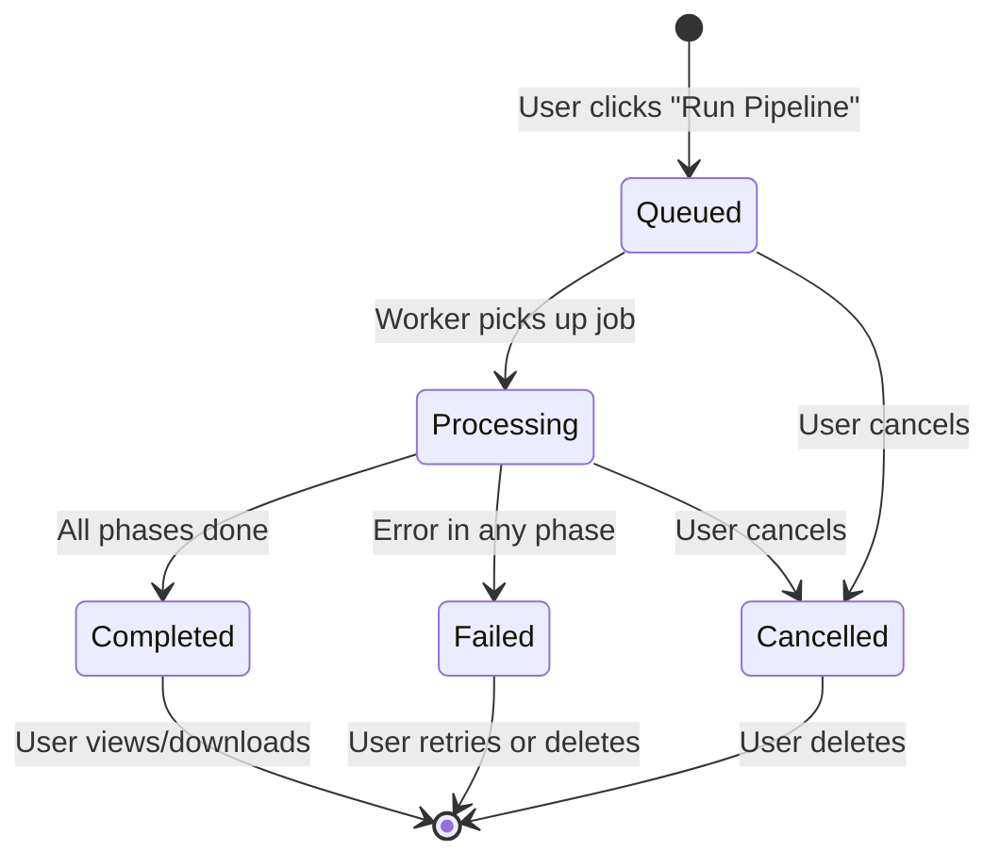

# Data CRUD — Functional Specification

> **Artifact:** `data_crud_contract.yaml`  
> **Repository path:** `openspec/specs/scraper/data_crud_contract.yaml`  
> **Usage:** Frontend report grid + backend report lifecycle contract  
> **Phase:** All phases (read across pipeline, write at completion)  
> **Status:** Draft  
> **Last Updated:** 2026-06-17

---

## 1. Overview

This document defines all CRUD operations for game analysis reports in GetSmart. It covers the report grid with sidebar filters, search, sorting, status tracking, and real-time updates via WebSocket.

The report grid is the **primary dashboard** where users browse, filter, and access their generated intelligence reports.

---

## 2. Report Lifecycle



### 2.1 Status Definitions

| Status | Color | Badge Style | Description |
|--------|-------|-------------|-------------|
| **Queued** | Gray | `bg-text-disabled/15 border-text-disabled/25` | Waiting for a worker |
| **Processing** | Amber | `bg-warning/15 border-warning/25` + pulsing dot | Pipeline is running |
| **Completed** | Green | `bg-success/15 border-success/25` | Report ready for viewing |
| **Failed** | Red | `bg-danger/15 border-danger/25` | Error occurred |
| **Cancelled** | Gray | `bg-text-disabled/15 border-text-disabled/25` | User cancelled |

---

## 3. Report Schema

A report is the central entity representing a complete game analysis:

```json
{
  "id": "550e8400-e29b-41d4-a716-446655440000",
  "game": {
    "id": "119388",
    "name": "Elden Ring",
    "slug": "elden-ring",
    "release_year": 2022,
    "developer": "FromSoftware",
    "publisher": "Bandai Namco",
    "genres": ["Action RPG", "RPG"],
    "platforms": ["PC", "PlayStation 5", "Xbox Series X|S"],
    "cover_url": "https://images.igdb.com/..."
  },
  "status": "completed",
  "current_phase": null,
  "progress_percent": 100,
  "outputs": {
    "markdown_url": "https://cdn.getsmart.dev/reports/.../report.md",
    "pdf_url": "https://cdn.getsmart.dev/reports/.../report.pdf",
    "json_url": "https://cdn.getsmart.dev/reports/.../report.json",
    "json_rag_url": "https://cdn.getsmart.dev/reports/.../report_rag.json"
  },
  "metadata": {
    "pipeline_id": "660e8400-e29b-41d4-a716-446655440001",
    "started_at": "2026-06-17T10:00:00Z",
    "completed_at": "2026-06-17T10:08:32Z",
    "duration_seconds": 512,
    "triggered_by": "user-uuid",
    "version": "3.0.0"
  },
  "summary": {
    "word_count": 12450,
    "sections_count": 12,
    "macro_skills_covered": ["design_and_art", "user_experience", "technology_and_systems", "strategy_and_market"],
    "key_findings": [
      "Revolutionary open-world design in Souls-like genre",
      "Exceptional art direction with cohesive dark fantasy aesthetic",
      "Strong retention through challenging but fair gameplay loop"
    ]
  },
  "tags": ["fromsoftware", "souls-like", "goty-2022"],
  "created_at": "2026-06-17T10:00:00Z",
  "updated_at": "2026-06-17T10:08:32Z"
}
```

---

## 4. Filter System

### 4.1 Available Filters

| Filter | Type | Options | Source |
|--------|------|---------|--------|
| **Genre** | Multi-select | Action RPG, Battle Royale, MOBA, Open World, Adventure, Action, RPG, Strategy, Shooter, Fighting, Racing, Simulation, Sports, Puzzle, Platformer | Game metadata |
| **Developer** | Multi-select | Riot Games, Epic Games, FromSoftware, CD Projekt Red, Nintendo, Santa Monica Studio, Naughty Dog, Bungie, Valve, Blizzard | Game metadata |
| **Platform** | Multi-select | PC, PlayStation, Xbox, Switch, Mobile | Game metadata |
| **Status** | Multi-select | Completed, Processing, Queued, Failed | Report state |
| **Year Range** | Range | 1980–2030 | Game release year |
| **Search** | Text | Free text | Game name, developer |

### 4.2 Facet Counts

Each filter option displays a count badge showing how many reports match that criteria **with current filters applied**:

```
Genre                    [Clear all]
☑ Action RPG        12
☐ Battle Royale      8
☐ MOBA               5
☐ Open World         9
☐ Adventure          7
```

### 4.3 Filter Logic

- **Within a filter group (e.g., Genre):** OR logic — `Action RPG OR Adventure`
- **Across filter groups:** AND logic — `(Action RPG OR Adventure) AND (PC) AND (Completed)`
- **Search text:** Fuzzy match on game name and developer

---

## 5. Sorting

| Option | Field | Direction | Description |
|--------|-------|-----------|-------------|
| **Most recent** | `created_at` | Desc | Newest reports first |
| **Alphabetical** | `game.name` | Asc | A–Z by game title |
| **Release year** | `game.release_year` | Desc | Newest games first |
| **Last updated** | `updated_at` | Desc | Recently changed |
| **Progress** | `progress_percent` | Desc | Most complete first |

---

## 6. Report Grid UI

### 6.1 Layout

```
┌─────────────────────────────────────────────────────────────────┐
│ Filters              │  Showing 28 reports    [Sort by ▼]       │
│                      │                                            │
│ Genre                │  ┌──────────┐ ┌──────────┐ ┌──────────┐ │
│ ☑ Action RPG    12   │  │ [IMG]    │ │ [IMG]    │ │ [IMG]    │ │
│ ☐ Battle Royale  8   │  │ ●Completed│ │ ●Completed│ │ ○Processing│ │
│ ☐ MOBA           5   │  │ Action   │ │ MOBA     │ │ Open World│ │
│ ☐ Open World     9   │  │ Elden    │ │ League   │ │ Zelda    │ │
│ ☐ Adventure      7   │  │ Ring     │ │ of Legends│ │ TOTK     │ │
│                      │  │ FromSoft │ │ Riot     │ │ Nintendo │ │
│ Developer            │  │ 2022     │ │ 2009     │ │ 2023     │ │
│ ☐ Riot Games     4   │  │ [] │ │ []     │ │ []     │ │
│ ☐ FromSoftware   3   │  │ 2h ago   │ │ 5h ago   │ │ Phase 3/4│ │
│ ...                  │  └──────────┘ └──────────┘ └──────────┘ │
│                      │                                            │
│ Platform             │  ┌──────────┐ ┌──────────┐ ┌──────────┐ │
│ ☑ PC            18   │  │ [IMG]    │ │ [IMG]    │ │ [IMG]    │ │
│ ☐ PlayStation   14   │  │ ●Completed│ │ ●Completed│ │ ●Completed│ │
│ ☐ Xbox          11   │  │ Action   │ │ Open     │ │ Battle   │ │
│ ☐ Switch         6   │  │ God of   │ │ Cyberpunk│ │ Fortnite │ │
│                      │  │ War      │ │ 2077     │ │          │ │
│ Status               │  │ Santa    │ │ CDPR     │ │ Epic     │ │
│ ☑ Completed    28    │  │ Monica   │ │ 2020     │ │ 2017     │ │
│ ☐ Processing     3   │  │ 2022     │ │          │ │          │ │
│                      │  │ []   │ │ [] │ │ []│ │
│                      │  │ 1d ago   │ │ 3d ago   │ │ 5d ago   │ │
│                      │  └──────────┘ └──────────┘ └──────────┘ │
│                      │                                            │
└──────────────────────┴────────────────────────────────────────────┘
```

### 6.2 Card Anatomy

Each report card is a `rounded-2xl` container with:

#### Image Section (`aspect-[16/10]`)
- Cover image with `overflow-hidden` and hover zoom (`scale-1.08`, `500ms`, `cubic-bezier`)
- Gradient overlay from bottom (`from-bg-surface`)
- **Status badge** (top-left, `12px` margin):
  - Completed: Green dot + "Completed" text
  - Processing: Amber pulsing dot + "Processing" + progress bar at bottom
  - Queued/Failed: Gray dot + label
- **Download button** (top-right, appears on hover): `36x36px`, surface/90 backdrop-blur, download icon

#### Content Section (`p-4`)
- **Genre chip:** Inline badge, `accent/10` background, `accent/20` border, `accent` text
- **Title:** `font-semibold text-base`, truncated, hover → `accent` color
- **Metadata:** `{developer} · {year}`, `text-sm text-muted`
- **Footer:** Platform icons (left) + relative timestamp (right)

### 6.3 Hover Effects

- Card: `translate-y: -4px`, shadow intensifies, border → `border-hover`
- Image: Zoom `1.08x`
- Download button: Fades in from opacity 0
- Title: Color transitions to accent blue

---

## 7. Real-Time Updates

### 7.1 WebSocket Events

The frontend maintains a WebSocket connection to receive live updates:

```typescript
const ws = new WebSocket('wss://api.getsmart.dev/v1/ws/reports');

ws.onmessage = (event) => {
  const { type, payload } = JSON.parse(event.data);

  switch(type) {
    case 'report.status_changed':
      updateReportCard(payload.report_id, payload);
      break;
    case 'report.completed':
      showNotification(`Report for ${payload.game_name} is ready!`);
      refreshReportList();
      break;
    case 'report.failed':
      showError(`Report failed: ${payload.error_message}`);
      break;
  }
};
```

### 7.2 Event Types

| Event | When | Payload |
|-------|------|---------|
| `report.status_changed` | Any status transition | `report_id`, `old_status`, `new_status`, `current_phase`, `progress_percent` |
| `report.completed` | Pipeline finishes successfully | `report_id`, `game_name`, `outputs` (URLs) |
| `report.failed` | Pipeline errors | `report_id`, `error_code`, `error_message`, `failed_phase` |

---

## 8. Caching Strategy

| Data | TTL | Invalidation | Strategy |
|------|-----|-------------|----------|
| Report list | 30s | On status change | SWR with revalidation |
| Report detail | 60s | On report update | SWR with revalidation |
| Filter facets | 5min | On new report | Background refresh |
| Report content | 1h | Never | Immutable, ETag |

---

## 9. API Endpoints

| Method | Path | Description | Auth |
|--------|------|-------------|------|
| GET | `/api/v1/reports` | List reports (paginated, filtered, sorted) | Cookie |
| GET | `/api/v1/reports/{id}` | Get single report | Cookie |
| GET | `/api/v1/reports/{id}/content` | Get report content (markdown/json) | Cookie |
| GET | `/api/v1/reports/{id}/download` | Download PDF | Cookie |
| PATCH | `/api/v1/reports/{id}` | Update tags/notes | Cookie |
| DELETE | `/api/v1/reports/{id}` | Delete report + files | Cookie |
| GET | `/api/v1/reports/facets` | Get filter options with counts | Cookie |

### 9.1 Pagination

```json
{
  "items": [...],
  "pagination": {
    "page": 1,
    "page_size": 12,
    "total": 28,
    "total_pages": 3,
    "has_next": true,
    "has_prev": false
  }
}
```

Default: `page=1`, `page_size=12`. Max: `page_size=50`.

---

## 10. Rate Limits

| Endpoint | Window | Max | Per |
|----------|--------|-----|-----|
| List reports | 1 min | 30 | User |
| Get report | 1 min | 60 | User |
| Download PDF | 1 hour | 20 | User |
