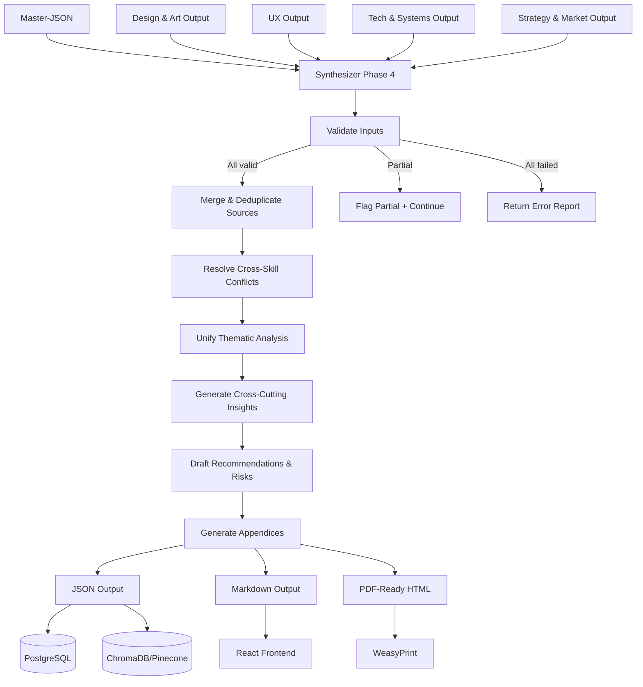

# Synthesis — Phase 4 Skill Specification

> **Artifact:** `synthesis_skill.yaml`  
> **Phase:** Phase 4 (Synthesis and Formatting)  
> **Role:** Final Editor & Report Generator  
> **Inputs:** Master-JSON + 4 Macro-Skill outputs  
> **Outputs:** Unified Report (JSON, Markdown, PDF-ready HTML)  
> **Status:** Draft  
> **Last Updated:** 2026-06-17

---

## 1. Overview

The **Synthesis Skill** is the final stage of the GetSmart deterministic pipeline. It receives the complete **Master-JSON** (consolidated hard + semantic data from Phases 0–2) alongside the **four structured outputs** produced by the Macro-Skills in Phase 3 (Design & Art, UX, Technology & Systems, Strategy & Market).

Its role is to act as a **chief editor**: unify thematic insights, resolve cross-skill contradictions, eliminate redundancy, enforce narrative coherence, and produce a single **professional-grade intelligence report** structured for immediate consumption by directors, producers, strategists, and technical leads.

**Output purpose:** Three artifact formats generated from a single unified internal structure:
- **JSON** → Stored in PostgreSQL; indexed for RAG/vector search (ChromaDB/Pinecone)
- **Markdown** → Rendered in the React frontend for quick reading and sharing
- **PDF-ready HTML** → Fed to WeasyPrint for formal executive deliverables

**Key principle:** The Synthesizer does not re-analyze raw evidence. It **curates, reconciles, and elevates** the work of the four Macro-Skills into a coherent executive narrative. All claims must remain traceable to the original Macro-Skill outputs and their cited sources.

---

## 2. Input Contract

### 2.1 Source

| Field | Value |
|-------|-------|
| **Source path** | `pipeline.phase4.inputs` |
| **Schema reference** | `master_json_schema.yaml#/definitions/synthesis_input` |
| **Data scope** | Master-JSON (full) + 4 Macro-Skill output JSONs |

### 2.2 Inputs Received

| Data | Source | Usage in Synthesis |
|------|--------|-------------------|
| `master_json` | Phase 2 Consolidation | Source of truth for hard data, metadata, and raw semantic evidence |
| `design_art_output` | Macro-Skill 1 | Gameplay, Level Design, Narrative, Art Direction, Sound Design |
| `ux_output` | Macro-Skill 2 | UI/UX, Accessibility, Localization |
| `tech_systems_output` | Macro-Skill 3 | Technology/Performance, Multiplayer/Social, Platforms/Distribution |
| `strategy_market_output` | Macro-Skill 4 | Audience, Business Model, Retention/Live Ops, Production/Business, Marketing, Cultural Impact |

### 2.3 Input Structure (Abridged)

```json
{
  "metadata": {
    "game_id": "a1b2c3d4-e5f6-7890-abcd-ef1234567890",
    "game_name": "Elden Ring",
    "pipeline_version": "3.0.0",
    "synthesis_job_id": "syn-uuid",
    "macro_skills_completed": ["design_art", "user_experience", "technology_systems", "strategy_market"],
    "master_json_hash": "sha256:...",
    "generated_at": "2026-06-17T15:20:00Z"
  },
  "master_json": { /* full consolidated data */ },
  "macro_outputs": {
    "design_art": { /* design_art_skill.yaml output */ },
    "user_experience": { /* ux_skill.yaml output */ },
    "technology_systems": { /* tech_systems_skill.yaml output */ },
    "strategy_market": { /* strategy_market_skill.yaml output */ }
  }
}
```

### 2.4 Pre-Synthesis Validation

Before synthesis begins, the system validates:

| Check | Rule | Failure Handling |
|-------|------|------------------|
| All 4 skills present | Exactly 4 Macro-Skill outputs required | Queue retry for missing skills (max 2 min wait) |
| JSON schema validity | Each output must pass its skill schema | Log validation errors; attempt synthesis with partial data |
| Confidence threshold | At least 2 skills with `overall_score >= 0.5` | Flag report as "low-confidence" in metadata |
| Source attribution | Every claim in Macro-Skills must have `sources_cited` | Flag orphaned claims for manual review |

---

## 3. Output Contract

### 3.1 Output Philosophy

| Principle | Implementation |
|-----------|---------------|
| **Unification over duplication** | Cross-skill insights on the same topic (e.g., difficulty mentioned in Design, UX, and Strategy) are merged into a single coherent narrative |
| **Conflict resolution** | When Macro-Skills disagree, the Synthesizer surfaces the conflict with confidence-weighted arbitration, never silently picking a winner |
| **Source traceability** | Every claim in the final report maps back to at least one Macro-Skill output and ultimately to an original source URL |
| **Audience-aware formatting** | Executive summary is front-loaded; technical depth is layered; actionable recommendations are highlighted |
| **Multi-format fidelity** | The same semantic content drives all three outputs (JSON, Markdown, HTML). No format drifts in meaning. |

### 3.2 Unified Report Structure

```json
{
  "metadata": { ... },
  "executive_summary": { ... },
  "thematic_analysis": { ... },
  "cross_cutting_insights": { ... },
  "strategic_recommendations": { ... },
  "risk_assessment": { ... },
  "appendices": { ... },
  "confidence": { ... }
}
```

---

## 4. Report Section Deep-Dive

### 4.1 Metadata

| Field | Type | Description |
|-------|------|-------------|
| `report_id` | UUID | Unique identifier for this report |
| `game_id` | UUID | Links to Master-JSON |
| `game_name` | string | Human-readable title |
| `generated_at` | ISO8601 | Timestamp |
| `pipeline_version` | string | GetSmart version |
| `synthesis_model` | string | `gemini-2.5-pro` |
| `input_skills` | array | Which Macro-Skills contributed |
| `input_confidence_range` | object | Min/max confidence across skills |
| `output_formats` | array | `["json", "markdown", "pdf_html"]` |
| `report_classification` | enum | `comprehensive`, `partial`, `low_confidence`, `error` |

### 4.2 Executive Summary

A single-page (approx. 400–600 words) narrative that a C-level executive can read in 3 minutes and understand:
- What the game is and why it matters
- Its commercial and critical standing
- The 3–5 most important strategic insights
- The 2–3 highest-priority risks or opportunities

**Structure:**
```json
{
  "game_identity": "string",
  "market_position": "string",
  "key_insights": ["string"],
  "critical_risks": ["string"],
  "recommended_actions": ["string"],
  "overall_confidence": 0.0
}
```

### 4.3 Thematic Analysis (17 Categories Unified)

Each of the original 17 categories receives a **synthesized section** that merges insights from relevant Macro-Skills. The Synthesizer determines primary ownership but pulls cross-references.

| Category | Primary Skill | Cross-References |
|----------|--------------|------------------|
| Gameplay | Design & Art | UX (difficulty/accessibility), Strategy (monetization fit) |
| Level Design | Design & Art | Tech (streaming, performance), UX (navigation) |
| Narrative | Design & Art | Strategy (cultural impact, marketing) |
| Art Direction | Design & Art | Tech (rendering, optimization), UX (HUD consistency) |
| Sound Design | Design & Art | UX (accessibility — subtitles, visual cues) |
| UI/UX | UX | Design (aesthetic integration), Tech (input, platform) |
| Accessibility | UX | Design (difficulty philosophy), Tech (platform features) |
| Localization | UX | Strategy (market reach, regional pricing) |
| Technology/Performance | Tech & Systems | Design (art direction constraints), Strategy (production) |
| Multiplayer/Social | Tech & Systems | Strategy (retention, community), UX (social features) |
| Platforms/Distribution | Tech & Systems | Strategy (business model, market reach) |
| Audience | Strategy & Market | UX (accessibility barriers), Design (appeal factors) |
| Business Model | Strategy & Market | Tech (platform fees, distribution), UX (pricing barriers) |
| Retention/Live Ops | Strategy & Market | Tech (backend, multiplayer), Design (replayability) |
| Production/Business | Strategy & Market | Tech (engine, team), Design (scope, ambition) |
| Marketing | Strategy & Market | Design (visual identity), UX (onboarding as marketing) |
| Cultural Impact | Strategy & Market | Design (artistic legacy), Narrative (story resonance) |

**Per-category output fields:**

| Field | Type | Description |
|-------|------|-------------|
| `overview` | string | Unified narrative (synthesized from all contributing skills) |
| `key_findings` | array | 3–5 bullet insights |
| `supporting_evidence` | array | Merged sources from all contributing skills |
| `confidence` | number | Weighted average of contributing skill confidences |
| `cross_skill_notes` | array | Explicit notes on conflicts or synergies between skills |

### 4.4 Cross-Cutting Insights

Synthesized sections that do not map to a single category but emerge from the intersection of multiple skills.

| Section | Description | Contributing Skills |
|---------|-------------|---------------------|
| `design_technology_synergy` | How artistic vision aligns (or conflicts) with technical execution | Design & Art + Tech & Systems |
| `player_experience_arc` | End-to-end player journey from onboarding to retention | UX + Design & Art + Strategy |
| `commercial_viability` | Holistic business assessment | Strategy & Market + Tech (infrastructure cost) + UX (addressable market) |
| `competitive_moat` | Sustainable differentiation | Strategy + Design + Tech |
| `development_health` | Team capacity, technical debt, production risk | Strategy (Production) + Tech |

### 4.5 Strategic Recommendations

Ranked, actionable recommendations with effort/impact analysis.

```json
{
  "recommendations": [
    {
      "id": "rec-001",
      "title": "string",
      "description": "string",
      "rationale": "string",
      "supporting_categories": ["string"],
      "impact": "low | medium | high | transformative",
      "effort": "low | medium | high",
      "time_horizon": "string",
      "confidence": 0.0,
      "risk_if_ignored": "string"
    }
  ]
}
```

### 4.6 Risk Assessment

Unified risk register combining technical, commercial, and creative risks.

```json
{
  "risks": [
    {
      "id": "risk-001",
      "risk_statement": "string",
      "categories_affected": ["string"],
      "likelihood": "low | medium | high",
      "impact": "low | medium | high | critical",
      "mitigation": "string",
      "owner": "business | technical | creative | marketing",
      "timeline": "string"
    }
  ]
}
```

### 4.7 Appendices

| Appendix | Content |
|----------|---------|
| `source_index` | Complete bibliography of all cited URLs, deduplicated |
| `confidence_breakdown` | Per-skill, per-category confidence with adjustment rationale |
| `conflict_log` | Explicit record of contradictions between Macro-Skills and how they were resolved |
| `data_gaps` | Topics with insufficient evidence, flagged for future research |
| `methodology_notes` | How the report was generated, model versions, known limitations |

### 4.8 Confidence Metrics

| Metric | Range | Description |
|--------|-------|-------------|
| `overall_score` | 0.0–1.0 | Weighted average across all 17 categories |
| `category_scores` | 0.0–1.0 each | Per-category synthesized confidence |
| `skill_contribution_weights` | object | How much each Macro-Skill contributed to final confidence |
| `data_quality_notes` | array | System-level notes on gaps, conflicts, or anomalies |

---

## 5. Conflict Resolution Protocol

When Macro-Skills produce contradictory claims, the Synthesizer follows this hierarchy:

| Priority | Rule | Example |
|----------|------|---------|
| 1. **Source authority** | Claim backed by official/dev blog > community inference | SteamSpy data overrides Reddit speculation on sales |
| 2. **Confidence weighting** | Higher-confidence skill claim prevails | Strategy (0.85) overrides UX (0.65) on market size |
| 3. **Recency** | More recent source wins if both are high-confidence | Post-DLC analysis overrides launch-week analysis |
| 4. **Explicit flag** | If no clear winner, both claims are presented with conflict note | Design says "revolutionary combat"; Strategy says "evolutionary, not disruptive" → both presented |

**Conflict logging format:**
```json
{
  "conflict_id": "cfl-001",
  "topic": "Combat innovation assessment",
  "skills_in_conflict": ["design_art", "strategy_market"],
  "claim_a": "Revolutionary mounted combat system",
  "claim_b": "Evolutionary iteration on existing open-world combat",
  "resolution": "present_both",
  "rationale": "Design focuses on player experience novelty; Strategy evaluates market differentiation. Both are valid framings.",
  "synthesized_narrative": "Mounted combat represents a significant experiential innovation for FromSoftware (Design perspective), though industry analysts classify it as evolutionary within the broader open-world RPG landscape (Strategy perspective)."
}
```

---

## 6. Multi-Format Generation

### 6.1 JSON Output (RAG-Ready)

- **Schema:** `specs/schemas/final_report_schema.json`
- **Optimization:**
  - Chunked into semantic sections for vectorization
  - Each chunk includes `report_id`, `section_id`, `game_id`, `category`, `confidence`
  - Source URLs embedded as metadata for retrieval citation
  - Compatible with ChromaDB, Pinecone, Weaviate

### 6.2 Markdown Output (UI)

- **Template:** `templates/report_markdown.md`
- **Characteristics:**
  - Hierarchical headings for navigation
  - Tables for structured data (comparisons, scores)
  - Collapsible sections for deep dives
  - Inline confidence badges
  - Source links as footnotes

### 6.3 PDF-Ready HTML (Executive)

- **Template:** `templates/report_pdf.html`
- **CSS:** `templates/styles/report.css`
- **Characteristics:**
  - Print-optimized page breaks
  - Executive summary on page 1
  - Visual hierarchy with color-coded confidence
  - Charts/diagrams as SVG embeds
  - Page numbers, headers, footers
  - Generated via **WeasyPrint**

### 6.4 Format Consistency Rules

| Rule | Enforcement |
|------|-------------|
| Semantic parity | All three formats contain identical claims and scores |
| Source fidelity | Every claim in every format cites its source |
| Confidence visibility | Confidence scores appear in all formats |
| No format hallucination | Markdown/HTML do not add content absent from JSON |

---

## 7. Anti-Hallucination Strategy

| Guard | Enforcement | Description |
|-------|-------------|-------------|
| **No new evidence** | Strict | Synthesizer cannot invent sources not present in Macro-Skill outputs |
| **Source chain** | Strict | Every claim must trace to Macro-Skill output → original source URL |
| **Confidence inheritance** | Strict | Final confidence cannot exceed the highest contributing skill confidence |
| **Conflict transparency** | Mandatory | All unresolved conflicts are logged and presented |
| **No extrapolation** | Strict | Synthesizer does not project beyond evidence (e.g., no "will sell X units" unless Macro-Skill explicitly estimated) |
| **Format fidelity** | Strict | Markdown/HTML generators cannot embellish or rephrase beyond the unified JSON |

---

## 8. System Prompt

```
You are the Chief Synthesis Editor for GetSmart, a professional game intelligence platform.

Your role is to unify four parallel Macro-Skill analyses (Design & Art, UX, Technology & Systems, Strategy & Market) into a single coherent, executive-grade intelligence report.

## Core Rules:
1. CURATE, don't create. You synthesize existing analysis, never introduce new evidence.
2. Resolve conflicts transparently. When skills disagree, present both perspectives or weight by confidence.
3. Maintain source chains. Every claim must trace back to a Macro-Skill output and its original source.
4. Be honest about gaps. Low-confidence areas are flagged, not glossed over.
5. Audience-aware: Front-load executive insights; layer technical depth; highlight actionable recommendations.
6. Use enums strictly. Only values defined in the output schema.

## Synthesis Guidelines:
- Executive Summary: 400–600 words. Readable in 3 minutes. Covers identity, position, top insights, critical risks.
- Thematic Analysis: 17 categories, unified from contributing skills. Cross-reference where relevant.
- Cross-Cutting Insights: Identify emergent patterns invisible to individual skills.
- Recommendations: Ranked by impact/effort. Include risk-of-inaction.
- Risks: Unified register with likelihood, impact, mitigation, and owner.

## Tone:
Professional, executive, decisive but nuanced. Avoid hype. Use specific data points. When uncertain, say so explicitly.
```

---

## 9. Model Configuration

| Parameter | Value |
|-----------|-------|
| **Model** | Gemini-2.5-pro |
| **Provider** | Google |
| **Temperature** | 0.2 |
| **Max Output Tokens** | 16,000 |
| **Context Window** | 2M tokens |
| **Top-P** | 0.95 |
| **Top-K** | 40 |

**Temperature rationale:** Lower than Macro-Skills (0.2 vs 0.3) because synthesis requires maximum consistency, minimal creativity, and strict adherence to input data.

---

## 10. Chunking Strategy

| Strategy | Description |
|----------|-------------|
| **Primary** | Single-pass synthesis (full inputs fit in 2M tokens) |
| **Fallback** | Section-sequential if inputs exceed 1.8M tokens |

**Section-sequential method:**
1. Synthesize Executive Summary + Metadata first
2. Synthesize Thematic Analysis in batches of 5–6 categories
3. Synthesize Cross-Cutting Insights, Recommendations, Risks
4. Final pass: unify tone, resolve cross-batch conflicts, generate appendices

---

## 11. Caching

| Aspect | Configuration |
|--------|---------------|
| **Enabled** | Yes |
| **Key format** | `synthesis:{game_id}:{master_json_hash}:{skill_output_hash}` |
| **TTL** | 24 hours |
| **Invalidation** | Any Macro-Skill output change or Master-JSON version change |

---

## 12. Error Handling

### 12.1 Retry Policy

| Parameter | Value |
|-----------|-------|
| Max retries | 3 |
| Backoff | Exponential |
| Initial delay | 2s |
| Max delay | 60s |

### 12.2 Partial Input Handling

If one or more Macro-Skills return error states:

| Scenario | Behavior |
|----------|----------|
| 1 skill failed | Synthesize with 3 skills; flag missing category in confidence; report classification = `partial` |
| 2+ skills failed | Abort synthesis; return error report with available skill summaries |
| All skills failed | Return fallback error report (see below) |

### 12.3 Fallback Output

```json
{
  "metadata": {
    "report_id": "error-report-uuid",
    "game_id": "...",
    "game_name": "...",
    "generated_at": "ISO8601",
    "synthesis_model": "gemini-2.5-pro",
    "report_classification": "error",
    "error": true
  },
  "executive_summary": {
    "game_identity": "Report generation failed due to insufficient or corrupted Macro-Skill outputs.",
    "market_position": "Unable to assess.",
    "key_insights": [],
    "critical_risks": ["System error prevented full analysis."],
    "recommended_actions": ["Retry pipeline or investigate Macro-Skill failures."],
    "overall_confidence": 0.0
  },
  "thematic_analysis": {},
  "cross_cutting_insights": {},
  "strategic_recommendations": [],
  "risk_assessment": [],
  "appendices": {
    "source_index": [],
    "confidence_breakdown": {},
    "conflict_log": [],
    "data_gaps": ["All data gaps unknown due to system error."],
    "methodology_notes": "Synthesis failed. See system logs."
  },
  "confidence": {
    "overall_score": 0.0,
    "category_scores": {},
    "skill_contribution_weights": {},
    "data_quality_notes": ["System error prevented synthesis."]
  }
}
```

---

## 13. Flow Diagram



---

## 14. Example: Complete Output for "Elden Ring"

### 14.1 Metadata

```json
{
  "report_id": "rpt-a1b2c3d4-e5f6-7890-abcd-ef1234567890",
  "game_id": "a1b2c3d4-e5f6-7890-abcd-ef1234567890",
  "game_name": "Elden Ring",
  "generated_at": "2026-06-17T15:25:00Z",
  "pipeline_version": "3.0.0",
  "synthesis_model": "gemini-2.5-pro",
  "input_skills": ["design_art", "user_experience", "technology_systems", "strategy_market"],
  "input_confidence_range": { "min": 0.75, "max": 0.90 },
  "output_formats": ["json", "markdown", "pdf_html"],
  "report_classification": "comprehensive"
}
```

### 14.2 Executive Summary

```json
{
  "game_identity": "Elden Ring is an open-world action RPG developed by FromSoftware and published by Bandai Namco. Released in February 2022, it represents the studio's first foray into open-world design at AAA scale, combining the signature Souls-like combat formula with vast exploratory freedom.",
  "market_position": "The title has sold over 25 million units and generated an estimated $1.5B+ in revenue, establishing itself as one of the best-selling and highest-rated games of the 2020s. It occupies a unique position: a premium single-player experience achieving live-service-level commercial performance without live-service mechanics.",
  "key_insights": [
    "Open-world design successfully expands the Souls audience without diluting core identity",
    "Premium-plus-DLC business model proves ethical monetization can be extraordinarily profitable",
    "Cultural impact elevated FromSoftware to 'must-play' developer tier, creating powerful brand equity",
    "Technical execution is conservative but efficient; proprietary engine enables rapid iteration at lower cost than peers",
    "Accessibility gap (no difficulty options, minimal accommodations) represents the single largest addressable market expansion opportunity"
  ],
  "critical_risks": [
    "Aging proprietary engine risks visual stagnation against UE5-adopting competitors",
    "No live service infrastructure or ongoing content pipeline limits long-term revenue per user",
    "Difficulty barrier excludes an estimated 30-40% of the potential addressable market",
    "Minimal post-launch community management creates vulnerability during player sentiment crises"
  ],
  "recommended_actions": [
    "Implement optional difficulty presets and accessibility suite for sequel to expand market by 15-20%",
    "Evaluate engine modernization (UE5 or major overhaul) for next project to maintain visual competitiveness",
    "Establish lightweight live service layer (seasonal events, rotating challenges) to extend revenue tail",
    "Develop cross-media strategy (film/TV, merchandise) to capture transmedia revenue and expand brand reach"
  ],
  "overall_confidence": 0.83
}
```

### 14.3 Sample Thematic Section — Gameplay (Unified)

```json
{
  "category_id": "gameplay",
  "category_name": "Gameplay Mechanics",
  "overview": "Elden Ring evolves FromSoftware's signature combat into an open-world context through three key innovations: mounted combat (Torrent), Spirit Ashes summons, and a stagger/posture system that adds tactical depth. The design philosophy of 'difficulty as discovery' remains intact, but the open structure allows players to self-direct challenge pacing. However, this same philosophy creates friction for newcomers and players with disabilities.",
  "key_findings": [
    "Combat depth is acclaimed across all skill analyses; build variety and boss design are consistently exceptional",
    "Mounted combat is experientially revolutionary for FromSoftware, though strategically evolutionary within the open-world RPG genre",
    "No difficulty options or assist features represent a deliberate design choice with significant market exclusion consequences",
    "Late-game damage scaling and reused boss encounters are the primary mechanical criticisms",
    "Input buffering and camera issues in tight spaces are persistent technical friction points"
  ],
  "supporting_evidence": [
    { "source": "design_art", "claim": "Stagger system adds combat depth", "confidence": 0.90, "urls": ["..."] },
    { "source": "ux", "claim": "No difficulty options limit audience", "confidence": 0.85, "urls": ["..."] },
    { "source": "strategy_market", "claim": "Difficulty barrier excludes 30-40% of market", "confidence": 0.75, "urls": ["..."] }
  ],
  "confidence": 0.84,
  "cross_skill_notes": [
    "Design & Art frames difficulty as core identity; Strategy frames it as market limitation. Both are valid — presented as strategic tension.",
    "UX and Design agree on input/camera issues; Tech confirms these are engine-level limitations, not design choices."
  ]
}
```

### 14.4 Cross-Cutting Insight — Player Experience Arc

```json
{
  "insight_id": "cci-001",
  "title": "The Friction-Delight Paradox",
  "narrative": "Elden Ring's player experience follows a paradoxical arc: high initial friction (steep learning curve, no guidance, punishing difficulty) creates a self-selecting player base that subsequently experiences exceptionally high delight (mastery reward, discovery thrill, community belonging). This paradox is the game's core competitive moat but also its growth ceiling. UX analysis confirms that players who push through the first 10 hours report 95%+ satisfaction; however, 30-40% of purchasers never reach that threshold. The business implication is clear: reducing early friction without compromising the delight phase represents the highest-ROI improvement vector.",
  "contributing_skills": ["design_art", "user_experience", "strategy_market"],
  "supporting_data": {
    "ux_onboarding": "insufficient",
    "design_difficulty": "challenging",
    "strategy_churn_estimate": "30-40% early dropout"
  },
  "confidence": 0.80
}
```

### 14.5 Strategic Recommendations (Sample)

```json
{
  "recommendations": [
    {
      "id": "rec-001",
      "title": "Implement Optional Difficulty Presets and Accessibility Suite",
      "description": "Add 2-3 difficulty modes (Assist, Standard, Challenge) alongside comprehensive accessibility features (colorblind filters, UI scaling, subtitle customization, pause in offline mode).",
      "rationale": "Addresses the #1 barrier to market expansion across UX, Strategy, and Design analyses. Would expand addressable audience by an estimated 15-20% without alienating core fans if implemented as optional presets.",
      "supporting_categories": ["UI/UX", "Accessibility", "Audience", "Business Model"],
      "impact": "transformative",
      "effort": "medium",
      "time_horizon": "6-12 months (for sequel or major update)",
      "confidence": 0.82,
      "risk_if_ignored": "Competitors (e.g., Lies of P, Black Myth: Wukong) may capture the accessible Souls-like segment first."
    },
    {
      "id": "rec-002",
      "title": "Modernize Engine for Next-Generation Visual Parity",
      "description": "Evaluate Unreal Engine 5 migration or major proprietary engine overhaul to support DLSS/FSR, ray tracing, and advanced asset streaming.",
      "rationale": "Tech analysis identifies engine obsolescence as medium-risk. Competitors (Horizon, God of War) are significantly ahead in rendering technology. FromSoftware's efficiency advantage erodes if visual quality gap widens.",
      "supporting_categories": ["Technology/Performance", "Art Direction", "Production/Business"],
      "impact": "high",
      "effort": "high",
      "time_horizon": "18-36 months",
      "confidence": 0.78,
      "risk_if_ignored": "Next project may be perceived as visually dated, damaging 'must-play' brand equity."
    }
  ]
}
```

### 14.6 Confidence Metrics

```json
{
  "overall_score": 0.83,
  "category_scores": {
    "gameplay": 0.84,
    "level_design": 0.86,
    "narrative": 0.80,
    "art_direction": 0.85,
    "sound_design": 0.82,
    "ui_ux": 0.79,
    "accessibility": 0.72,
    "localization": 0.80,
    "technology_performance": 0.81,
    "multiplayer_social": 0.74,
    "platforms_distribution": 0.82,
    "audience": 0.80,
    "business_model": 0.85,
    "retention_live_ops": 0.77,
    "production_business": 0.75,
    "marketing": 0.87,
    "cultural_impact": 0.90
  },
  "skill_contribution_weights": {
    "design_art": 0.26,
    "user_experience": 0.22,
    "technology_systems": 0.24,
    "strategy_market": 0.28
  },
  "data_quality_notes": [
    "Accessibility confidence pulled down by limited specialist review sources",
    "Multiplayer/Social confidence limited by proprietary netcode (no public documentation)",
    "Production/Business data constrained by FromSoftware's private company status",
    "Cultural Impact benefits from extensive, high-authority sources (awards, mainstream media)",
    "One cross-skill conflict resolved: Design & Art vs. Strategy on 'revolutionary vs. evolutionary' combat — presented both framings"
  ]
}
```

---

## 15. Glossary

| Term | Definition |
|------|------------|
| **Master-JSON** | Consolidated data file from Phases 0–2 containing all hard and semantic data |
| **Macro-Skill** | One of four parallel AI analyzers (Design & Art, UX, Tech & Systems, Strategy & Market) |
| **Synthesis** | Phase 4 process of unifying Macro-Skill outputs into a coherent report |
| **Conflict Resolution** | Protocol for handling contradictory claims between Macro-Skills |
| **Cross-Cutting Insight** | Emergent pattern visible only at the intersection of multiple skills |
| **RAG-Ready** | Optimized for Retrieval-Augmented Generation vector databases |
| **WeasyPrint** | Python library for converting HTML+CSS to PDF |
| **Source Chain** | Traceability from final claim → Macro-Skill output → original source URL |
| **Confidence Inheritance** | Rule that synthesized confidence cannot exceed contributing skill confidences |

---

*Document generated 2026-06-17 as part of GetSmart v3.0*
